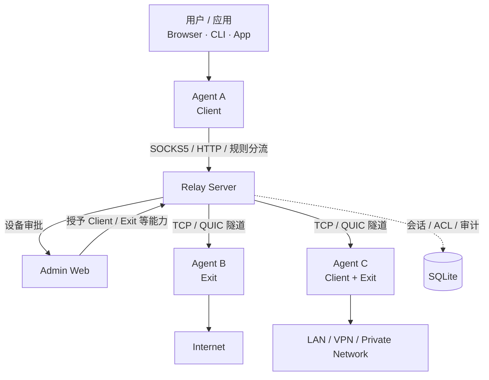
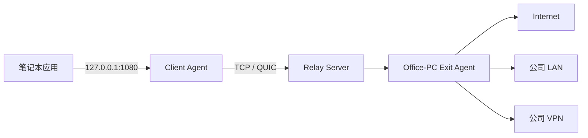
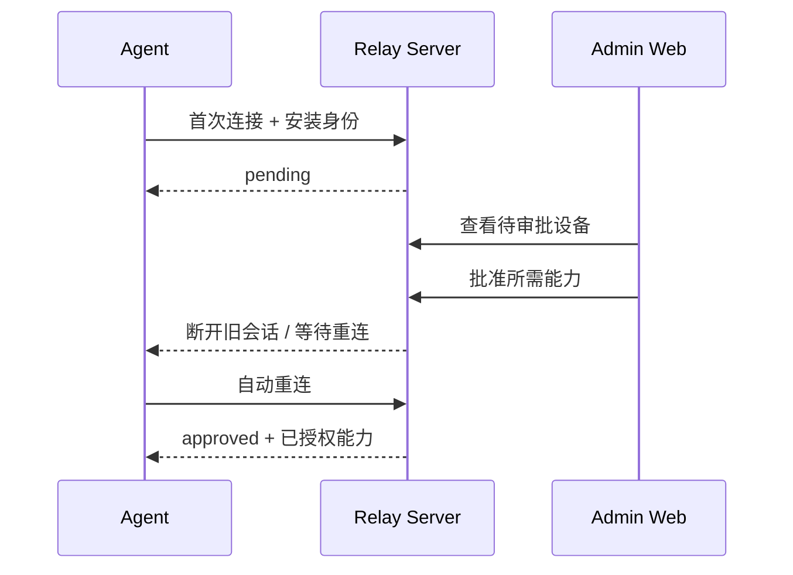
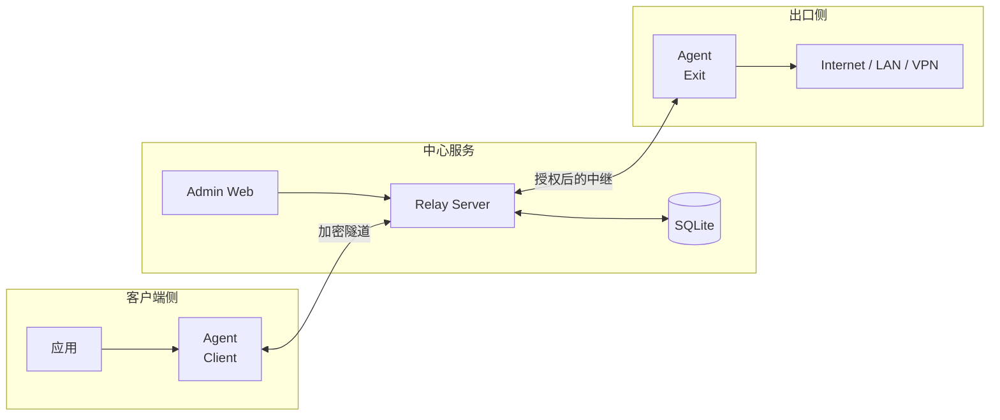
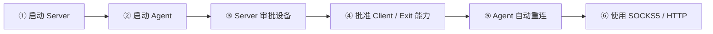
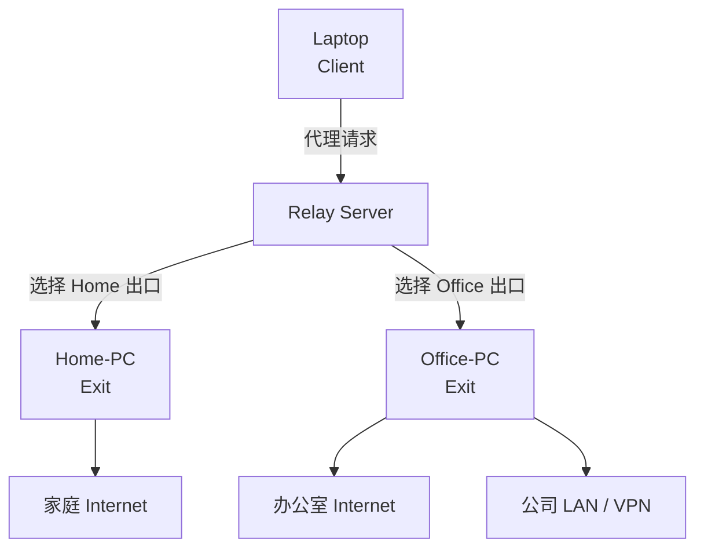
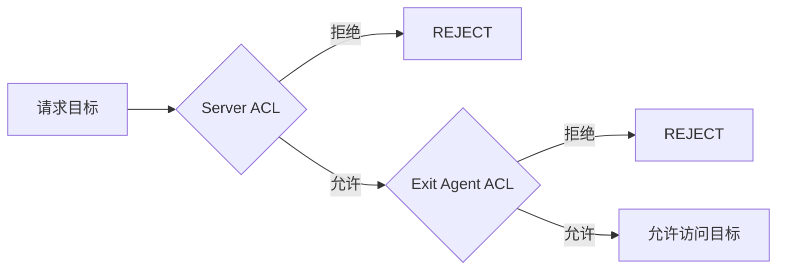
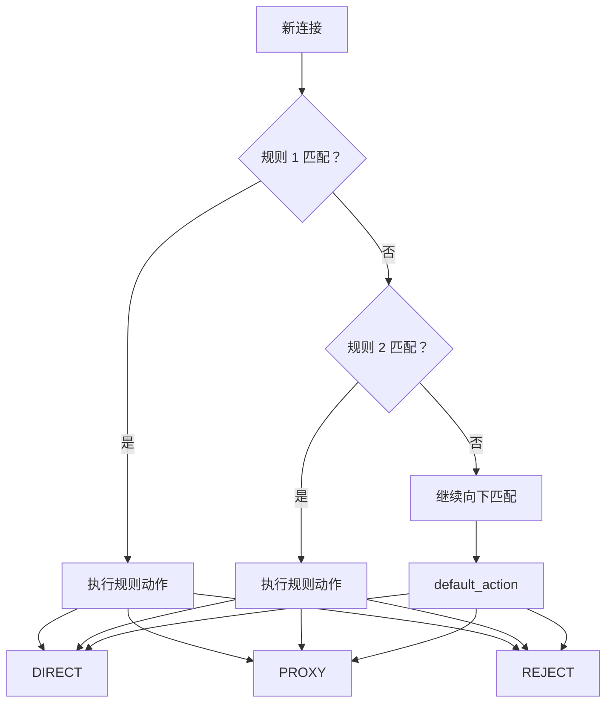
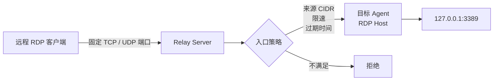

<p align="center">
  
</p>

<h1 align="center">RelayProxy</h1>

<p align="center">
  面向个人、多设备和小型私有网络的自建中继代理系统
</p>

<p align="center">
  <code>TCP / QUIC</code>
  ·
  <code>SOCKS5 / HTTP</code>
  ·
  <code>多出口</code>
  ·
  <code>规则分流</code>
  ·
  <code>设备审批</code>
  ·
  <code>Admin Web</code>
</p>

RelayProxy 由一个中心 **Relay Server** 和多个 **Relay Agent** 组成。Agent 可以作为本地代理客户端，也可以作为出口节点；Server 负责设备身份审批、权限控制、会话协调、流量中继、设备管理和 Web 管理。

> **Relay Desktop 开发进度（2026-09-21）**
>
> 统一 Remote Desktop 模型、GUI 入口、独立 `desktop.controller / desktop.host` 授权、目标发现、RD/1 QUIC Datagram 媒体通道与 Server 双跳 Relay 已进入主线。Windows 可视 MVP 正在 `feature/relay-desktop-windows-mvp` 分支验证：当前采用 **GDI 抓屏 → 最高约 1280×720 / 10 FPS → JPEG → RD/1 → Wails 内置预览**，用于先打通 Windows Home 的完整画面链路。
>
> 该 JPEG 路径仍属于开发验证，不是最终高性能实现，也尚未作为正式发布能力。后续仍按设计升级为 **DXGI Desktop Duplication / WGC + Media Foundation H.264 硬件编解码 + 原生 D3D11 Viewer**，并继续补齐键鼠、光标、剪贴板、P2P、ABR 与性能统计。详细进度见 `docs/superpowers/plans/2026-09-21-remote-desktop-development.md`。

> 适合自建、受信任环境。公网部署时请启用 TLS、设置强管理密码、限制防火墙端口，并谨慎开放私网、回环地址和 RDP 入口。

## 适合做什么

| 场景 | 说明 |
| --- | --- |
| 🌐 远程出口 | 让笔记本通过家里或办公室电脑访问网络 |
| 🏢 内网 / VPN 访问 | 通过处于公司 LAN 或 VPN 中的 Exit Agent 访问内部资源 |
| 🧭 多出口切换 | 在 Home / Office / Cloud 等多个出口之间切换 |
| 🔀 按规则分流 | 按进程、域名/IP、端口和协议选择 DIRECT / PROXY / REJECT |
| 🛡️ 集中授权 | 所有新设备先进入待审批，再由 Server 授予能力 |
| 🖥️ 图形化管理 | Windows Wails GUI + Agent 本地 Web + Server Admin Web |
| 📊 运行监控 | 查看在线设备、活动会话、实时连接、日志和流量 |
| 🔐 受控 RDP 入口 | 为指定设备创建带来源限制、限速和过期时间的入口 |

## 一图看懂



### 一个典型流量路径



## 首次接入流程



Server 不会因为 Agent 声明了某项能力就自动授权。新安装的 Agent 首次连接后进入 **待审批**，管理员必须在 Server Web 控制台中明确批准其能力。

## 文档导航

- [主要功能](#2-主要功能)
- [支持平台](#3-平台)
- [快速开始](#4-快速开始)
- [SOCKS5--HTTP](#5-使用-socks5--http-代理)
- [出口节点](#6-出口节点)
- [访问权限](#7-出口节点访问权限)
- [路由分流](#8-路由分流)
- [Windows 系统透明代理](#9-windows-系统透明代理)
- [Agent GUI / Web](#10-agent-gui-与本地-web-管理)
- [Server Web](#11-server-web-管理)
- [RDP 公网入口](#12-rdp-公网入口)
- [TLS 与 QUIC](#13-tls-与-quic)
- [完整配置](#14-agent-完整配置示例)
- [命令行](#15-agent-命令行)
- [编译](#17-编译)
- [常见问题](#20-常见问题)

---

## 1. 工作方式

RelayProxy 的核心不是“把所有设备直接互相暴露”，而是让设备先连接中心 Server，由 Server 管理身份、能力和流量路径。



角色关系可以简单理解为：

- **Client**：发起代理请求。
- **Exit**：替其他设备访问最终目标。
- **Client + Exit**：一台 Agent 同时具备两种能力。
- **Server**：不直接充当任意网络出口，主要负责认证、授权、协调和中继。

---

## 2. 主要功能

### Relay Server

- TCP 隧道。
- QUIC 隧道。
- TLS 加密。
- SQLite 持久化。
- 设备身份与审批。
- 设备能力授权。
- 在线设备与会话管理。
- 出口节点管理。
- 中央目标访问 ACL。
- 连接审计与流量统计。
- RDP 公网入口。
- Admin Web 管理控制台。
- 管理密码修改。
- 在线修改服务配置。
- 删除、撤销设备。

### Relay Agent

- SOCKS5 代理。
- HTTP 代理。
- 自动选择或指定出口节点。
- Client / Exit 组合能力。
- 按规则路由：
  - DIRECT
  - PROXY
  - REJECT
- 按进程匹配。
- 按域名 / IP 匹配。
- 按端口匹配。
- 按 TCP / UDP 匹配。
- 实时连接监控。
- 本地运行日志。
- Windows Wails 原生 GUI。
- 本地 Web 管理页面。
- 系统托盘和开机自启。

---

## 3. 平台

| 平台 | Server | Agent | GUI | SOCKS5 / HTTP | 系统透明代理 |
| --- | --- | --- | --- | --- | --- |
| Windows x64 | ✅ | ✅ | ✅ | ✅ | ✅ |
| Windows ARM64 | ✅ | ✅ | ✅ | ✅ | — |
| Linux x64 | ✅ | ✅ | Web | ✅ | ✅ |
| Linux ARM64 | ✅ | ✅ | Web | ✅ | ✅ |
| macOS Intel | — | ✅ | Web / App | ✅ | 需要对应系统扩展环境 |
| macOS Apple Silicon | — | ✅ | Web / App | ✅ | 需要对应系统扩展环境 |

Windows ARM64 仍然可以正常使用 Relay 隧道、SOCKS5、HTTP、本地 Web 管理和出口节点能力。

---

# 4. 快速开始

下面先给出一个最容易验证连通性的 **局域网测试配置**。



测试配置使用明文 TCP。确认功能正常后，公网或跨网络部署请切换到 TLS。

假设：

```text
Relay Server: 192.168.1.10
Tunnel Port:  20000
Admin Port:   20001
```

## 4.1 启动 Server

创建：

```yaml
# relay-server.yaml

server:
  tls_enabled: false

  quic:
    listen: ":20000"

  tls:
    listen: ":20000"

  admin:
    listen: ":20001"
    tls_enabled: false

  cert_file: ""
  key_file: ""

database:
  driver: sqlite
  dsn: relayproxy.db

tunnel:
  heartbeat_sec: 15
  max_connections_per_device: 1024
  max_connections: 2048

rdp:
  lease_sec: 60
  rendezvous_listen: ""
  rendezvous_advertise: ""

  ingress:
    enabled: false
    listen: "0.0.0.0:0"
    port_start: 20100
    port_end: 20200
    source_cidrs: []
    rate_limit_per_minute: 120

relay_acl:
  allow_internet: true
  allow_private_network: false
  allow_loopback: false

  access:
    mode: ""
    domains: []
    cidrs: []

logging:
  level: info
```

### Linux

```bash
export RELAY_ADMIN_PASSWORD='change-this-password'

chmod +x relay-server

./relay-server -config relay-server.yaml
```

### Windows PowerShell

```powershell
$env:RELAY_ADMIN_PASSWORD = "change-this-password"

.\relay-server.exe -config .\relay-server.yaml
```

然后访问：

```text
http://192.168.1.10:20001
```

默认管理员账号：

```text
admin
```

如果未设置 `RELAY_ADMIN_PASSWORD`，Server 首次初始化数据库时会生成随机管理密码，并在控制台中显示一次。

建议正式部署时显式设置管理密码。

---

## 4.2 配置第一个 Agent

创建：

```yaml
server:
  address: 192.168.1.10
  tcp_port: 20000
  quic_port: 20000
  tls_enabled: false

device:
  name: My-PC

transport:
  mode: tcp_only
```

Windows GUI 可以直接启动：

```powershell
.\relay-agent-gui.exe
```

命令行：

```powershell
.\relay-agent.exe --no-gui --config .\relay-agent.yaml
```

Linux：

```bash
chmod +x relay-agent

./relay-agent --no-gui --config ./relay-agent.yaml
```

Agent 首次连接 Server 时不会自动获得访问权限。

---

## 4.3 在 Server 批准设备

打开 Server 管理页面：

```text
设备管理
→ 待审批申请
→ 选择设备
→ 批准需要的能力
```

常见能力用途：

| 能力 | 作用 |
| --- | --- |
| Client | 允许设备通过其他出口访问网络 |
| Exit | 允许其他设备使用本机作为出口 |
| RDP Host | 允许本机提供 RDP 目标服务 |
| RDP Public | 允许为该设备创建公网 RDP 入口 |

批准后 Agent 会自动重新连接。

---

# 5. 使用 SOCKS5 / HTTP 代理

默认本地监听：

```text
SOCKS5  127.0.0.1:1080
HTTP    127.0.0.1:8080
```

## SOCKS5

```bash
curl -x socks5h://127.0.0.1:1080 https://ipinfo.io
```

浏览器代理：

```text
SOCKS5 Host: 127.0.0.1
Port:        1080
```

建议使用远端 DNS 的 SOCKS5 模式，例如 curl 的：

```text
socks5h://
```

## HTTP

```bash
curl -x http://127.0.0.1:8080 https://ipinfo.io
```

---

# 6. 出口节点

Agent 可以同时拥有 Client 和 Exit 能力。



同一个 Client 可以根据默认出口或路由规则，把不同连接送往不同 Exit。

Laptop 可以选择：

```text
Home-PC
```

或者：

```text
Office-PC
```

作为出口。

Agent 配置中可以指定默认出口：

```yaml
proxy:
  default_exit_id: "dev_xxxxxxxxx"
```

如果没有指定，并且当前只有一个可用出口，客户端可以自动使用该出口。

GUI 中也可以直接选择出口节点。

---

# 7. 出口节点访问权限

出口权限由两层控制共同决定，最终结果取二者交集：



换句话说：

```text
最终允许 = Server ACL ∩ Exit Agent ACL
```

也就是说，两边都允许时请求才会真正放行。

## Server ACL

例如允许公网和私网：

```yaml
relay_acl:
  allow_internet: true
  allow_private_network: true
  allow_loopback: false
```

如果只允许指定目标：

```yaml
relay_acl:
  allow_internet: true
  allow_private_network: true
  allow_loopback: false

  access:
    mode: allow
    domains:
      - "*.example.com"
      - ".corp.example"

    cidrs:
      - "10.0.0.0/8"
      - "192.168.1.0/24"
```

## Exit Agent ACL

```yaml
exit:
  enabled: true

  allow_internet: true
  allow_private_network: true
  allow_loopback: false

  access:
    mode: allow

    domains:
      - "*.example.com"

    cidrs:
      - "10.0.0.0/8"
```

如果想通过办公室电脑访问公司 LAN 或 VPN 网络，需要同时允许 Server 和对应 Exit Agent 的：

```text
private_network
```

---

# 8. 路由分流

RelayProxy 使用组合路由规则决定连接如何处理。



支持三种动作：

```text
DIRECT
PROXY
REJECT
```

规则按顺序匹配，使用第一条命中的规则。

示例：

```yaml
routing:
  mode: rule
  default_action: DIRECT

  rules:
    - name: Chrome HTTPS
      enabled: true

      processes:
        - "chrome*"
        - "*msedge.exe"

      targets:
        - "*.example.com"
        - "203.0.113.*"

      ports:
        - "443"
        - "8000-9000"

      protocols:
        - tcp

      action: PROXY
      exit_id: "office-exit"
```

规则字段之间为 **AND**：

```text
process
AND target
AND port
AND protocol
```

同一字段中的多个值为 **OR**。

例如：

```yaml
processes:
  - chrome.exe
  - msedge.exe
```

表示：

```text
chrome.exe OR msedge.exe
```

支持：

- 精确进程名。
- 进程路径。
- `*` / `?` 通配。
- 域名。
- IPv4 / IPv6。
- CIDR。
- 单端口。
- 端口范围。
- TCP / UDP。

---

# 9. Windows 系统透明代理

Windows x64 可以将：

```yaml
network:
  mode: divert
```

启用为系统级透明代理。

GUI 中对应：

```text
代理与路由
→ 本地代理
→ 系统透明代理
```

该模式需要管理员权限。

它可以将应用新建的 TCP / UDP 流量交给统一路由规则：

```text
应用
 ↓
透明捕获
 ↓
路由规则
 ├── DIRECT
 ├── PROXY -> Relay Server -> Exit
 └── REJECT
```

可以通过：

```yaml
network:
  mode: divert

  exclude_processes:
    - updater.exe
    - backup.exe
```

排除特定进程。

Windows ARM64 当前建议使用 SOCKS5 / HTTP 模式。

---

# 10. Agent GUI 与本地 Web 管理

### 界面分工

| 界面 | 主要用途 |
| --- | --- |
| 🖥️ Windows Wails GUI | 日常配置、出口切换、路由规则、实时连接、日志 |
| 🌐 Agent 本地 Web | 无桌面环境或浏览器管理，默认仅回环访问 |
| 🛠️ Server Admin Web | 设备审批、能力授权、出口与会话、RDP 入口、服务配置 |

## Windows GUI

Windows 桌面客户端使用 **Wails v3 + WebView2**，继续复用 Agent Web 的界面与业务桥接能力。

启动：

```powershell
.\relay-agent-gui.exe
```

GUI 支持：

- 连接状态。
- Server 配置。
- 设备身份。
- 出口选择。
- SOCKS5 / HTTP。
- 系统代理设置。
- 路由规则。
- Exit 权限。
- 实时连接。
- 日志。
- 自动启动。
- 浅色 / 深色主题。
- 系统托盘。

默认关闭窗口时最小化到托盘。

## 本地 Web

Agent 默认同时启动：

```text
http://127.0.0.1:9090
```

它只允许监听 loopback 地址，不能设置为：

```text
0.0.0.0
```

可通过配置修改：

```yaml
web:
  enabled: true
  listen: 127.0.0.1
  port: 9090
```

也可以关闭：

```yaml
web:
  enabled: false
```

命令行临时关闭：

```bash
relay-agent --no-web
```

---

# 11. Server Web 管理

Server Admin Web 用于：

- 查看在线设备。
- 查看出口节点。
- 查看活跃会话。
- 审批新设备。
- 修改设备能力。
- 撤销设备。
- 删除设备。
- 管理 RDP 公网入口。
- 修改服务配置。
- 修改管理员密码。
- 查看流量统计。

设备支持两个不同操作：

### 撤销

```text
撤销设备授权
```

效果：

- 立即断开当前连接。
- 保留设备身份。
- 该安装身份不能直接重新申请。

### 删除

```text
删除设备
```

效果：

- 立即断开当前连接。
- 删除设备记录。
- 删除相关授权。
- 删除相关 RDP 关系。
- 删除之前的审批身份。
- 客户端再次连接时重新进入待审批。

---

# 12. RDP 公网入口

RelayProxy 可以由 Server 为已经授权的 RDP Host 创建受控公网入口。



默认：

```yaml
rdp:
  ingress:
    enabled: false
```

建议保持默认关闭，需要时再启用。

示例：

```yaml
rdp:
  lease_sec: 60

  rendezvous_listen: ":3478"
  rendezvous_advertise: "relay.example.com:3478"

  ingress:
    enabled: true
    listen: "0.0.0.0:0"

    port_start: 20100
    port_end: 20200

    source_cidrs:
      - "203.0.113.0/24"

    rate_limit_per_minute: 120
```

然后在 Server Web：

```text
RDP 公网入口
→ 创建入口
→ 选择目标设备
→ 设置固定或自动端口
→ 设置来源 CIDR
→ 设置限速 / 过期时间
```

公网环境强烈建议设置来源 CIDR，不要无条件暴露 RDP。

---

# 13. TLS 与 QUIC

正式部署建议：

```yaml
server:
  tls_enabled: true

  quic:
    listen: ":443"

  tls:
    listen: ":443"

  admin:
    listen: ":8443"
    tls_enabled: true

  cert_file: "/path/to/fullchain.pem"
  key_file: "/path/to/privkey.pem"
```

Agent：

```yaml
server:
  address: relay.example.com
  tcp_port: 443
  quic_port: 443
  tls_enabled: true

transport:
  mode: auto
```

传输模式：

| mode | 行为 |
| --- | --- |
| `auto` | 优先 QUIC，失败时回退 TCP |
| `quic_only` | 仅 QUIC |
| `tcp_only` | 仅 TCP |

QUIC 依赖 TLS。

如果 Server 关闭 TLS，Agent 必须同步：

```yaml
server:
  tls_enabled: false

transport:
  mode: tcp_only
```

`--insecure` 只建议用于测试自签名环境，不建议用于正式部署。

---

# 14. Agent 完整配置示例

```yaml
server:
  address: relay.example.com
  tcp_port: 443
  quic_port: 443
  tls_enabled: true

device:
  name: Work-Laptop

transport:
  mode: auto

proxy:
  socks5:
    enabled: true
    listen: 127.0.0.1
    port: 1080

  http:
    enabled: true
    listen: 127.0.0.1
    port: 8080

  default_exit_id: ""

exit:
  enabled: true
  allow_internet: true
  allow_private_network: false
  allow_loopback: false

  access:
    mode: ""
    domains: []
    cidrs: []

network:
  mode: ""

  exclude_processes:
    - relayproxy
    - relayproxy.exe
    - RelayProxy.exe

routing:
  mode: rule
  default_action: PROXY
  rules: []

gui:
  enabled: true
  minimize_to_tray: true
  start_minimized: false
  theme: system

web:
  enabled: true
  listen: 127.0.0.1
  port: 9090

logging:
  level: info
```

实际上首次安装时不需要写这么多。

最小 Agent 配置可以只有：

```yaml
server:
  address: relay.example.com
```

当 Server 使用默认的 443 端口和 TLS 时，其余选项会自动采用安全默认值。

---

# 15. Agent 命令行

查看版本：

```bash
relay-agent --version
```

指定配置文件：

```bash
relay-agent --config ./relay-agent.yaml
```

临时覆盖 Server：

```bash
relay-agent --server relay.example.com
```

指定出口：

```bash
relay-agent --exit dev_xxxxx
```

覆盖 SOCKS5：

```bash
relay-agent --socks5 127.0.0.1:1081
```

覆盖 HTTP：

```bash
relay-agent --http 127.0.0.1:8081
```

无 GUI：

```bash
relay-agent --no-gui
```

关闭本地 Web：

```bash
relay-agent --no-web
```

修改 Web 端口：

```bash
relay-agent --web-port 9091
```

Windows 最小化启动：

```powershell
.\relay-agent-gui.exe --minimized
```

---

# 16. Server 命令行

Server 主要参数：

```text
-config
```

例如：

```bash
./relay-server -config ./configs/relay-server.yaml
```

或者：

```powershell
.\relay-server.exe -config .\configs\relay-server.yaml
```

---

# 17. 编译

项目当前使用：

```text
Go 1.27.1
```

## Windows

PowerShell 5.1 或更高版本：

```powershell
.\scripts\build.ps1
```

指定版本：

```powershell
.\scripts\build.ps1 -Version "1.0.0"
```

## Linux / macOS

```bash
chmod +x scripts/build.sh

VERSION=1.0.0 ./scripts/build.sh
```

构建脚本会生成跨平台产物、配置文件和 SHA256 校验清单。

主要产物：

```text
dist/
├── RelayProxy-agent-windows-amd64.zip
├── RelayProxy-<target>.zip / .tar.gz
├── SHA256SUMS.txt
│
├── windows-amd64/
│   ├── relay-agent-gui.exe
│   ├── relay-agent.exe
│   ├── relay-server.exe
│   └── windivert/
│
├── windows-arm64/
│   ├── relay-agent-gui.exe
│   ├── relay-agent.exe
│   └── relay-server.exe
│
├── linux-amd64/
│   ├── relay-agent
│   └── relay-server
│
├── linux-arm64/
│   ├── relay-agent
│   └── relay-server
│
├── darwin-amd64/
│   ├── relay-agent
│   ├── relay-server
│   └── RelayProxy.app
│
├── darwin-arm64/
│   ├── relay-agent
│   ├── relay-server
│   └── RelayProxy.app
│
├── darwin-universal/                # 仅在 macOS + lipo 环境生成
│   ├── relay-agent
│   ├── relay-server
│   └── RelayProxy.app
│
└── darwin-native/                   # 可选：xcodegen + Xcode + DEVELOPMENT_TEAM
    └── RelayProxyMacHost.app        # 内嵌 NetworkExtension
```

其中 macOS Server 是“可构建实验产物”，不改变上方平台表中的正式支持范围。原生 macOS NetworkExtension App 只会在 macOS 构建机具备 Xcode、xcodegen，并设置 `DEVELOPMENT_TEAM` 时尝试生成；缺少这些条件时会跳过，不影响其余跨平台产物。

---

# 18. 开发与测试

运行全部 Go 测试：

```bash
go test ./... -count=1
```

静态检查：

```bash
go vet ./...
```

只测试某个包：

```bash
go test ./agent/...
go test ./server/...
```

建议代码修改后至少运行：

```bash
go test ./... -count=1
go vet ./...
```

---

# 19. 目录结构

```text
RelayProxy/
├── agent/
│   ├── app/                Agent 核心
│   ├── bridge/             GUI / Web 桥接
│   ├── divert/             系统透明代理
│   ├── gui/                Agent GUI 与本地 Web
│   ├── proxy/              SOCKS5 / HTTP
│   ├── routing/            路由规则
│   └── ...
│
├── server/
│   ├── api/                Admin API
│   ├── gateway/            Relay 数据面
│   ├── rdp/                RDP 服务
│   ├── repository/         SQLite 持久层
│   ├── service/            服务层
│   ├── session/            在线会话
│   └── web/                Server Admin Web
│
├── cmd/
│   ├── relay-agent/
│   └── relay-server/
│
├── configs/
│   ├── relay-agent.yaml
│   └── relay-server.yaml
│
├── docs/
├── scripts/
└── go.mod
```

---

# 20. 常见问题

## Agent 一直显示“等待服务端审批”

这是正常的首次连接流程。

进入 Server Web：

```text
设备管理
→ 待审批申请
```

批准对应设备。

---

## Agent 无法连接 Server

检查：

1. Server 是否已经运行。
2. TCP 端口是否放行。
3. QUIC 使用的 UDP 端口是否放行。
4. Agent 的 `tcp_port` / `quic_port` 是否与 Server 一致。
5. Server 与 Agent 的 TLS 设置是否一致。
6. 域名是否解析正确。
7. 防火墙或 NAT 是否允许对应端口。

---

## QUIC 不通但 TCP 正常

使用：

```yaml
transport:
  mode: auto
```

客户端会优先尝试 QUIC，并在需要时回退 TCP。

如果网络明确禁止 UDP，可以直接：

```yaml
transport:
  mode: tcp_only
```

---

## SOCKS5 / HTTP 能启动，但无法访问目标

依次检查：

```text
设备是否已批准
       ↓
是否存在可用 Exit
       ↓
Server ACL 是否允许
       ↓
Exit Agent ACL 是否允许
       ↓
路由规则是否为 PROXY
```

---

## 无法访问出口设备所在的局域网

Server：

```yaml
relay_acl:
  allow_private_network: true
```

对应 Exit：

```yaml
exit:
  allow_private_network: true
```

两边都需要允许。

---

## 无法访问出口设备本机服务

需要显式允许回环：

```yaml
allow_loopback: true
```

回环访问权限风险较高，只建议在明确知道目标服务用途时开启。

---

## Windows 系统透明代理无法启动

确认：

- 使用 Windows x64。
- 以管理员权限启动。
- 配置中 `network.mode` 为 `divert`。
- 安全软件没有阻止网络捕获组件。
- 重新启动 Agent 后再测试新建连接。

---

## 删除设备后为什么又出现在待审批列表

这是预期行为。

删除表示彻底忘记这台设备的审批身份。

客户端再次连接时会被视为新的待审批安装。

如果希望禁止该安装身份继续重新申请，请使用：

```text
撤销设备授权
```

而不是删除。

---

# 21. 安全建议

生产环境至少建议：

1. Relay 隧道启用 TLS。
2. 使用受信任证书。
3. 设置强 `RELAY_ADMIN_PASSWORD`。
4. Admin Web 只开放给管理网络或通过防火墙限制来源。
5. 不需要时关闭 `allow_private_network`。
6. 默认保持 `allow_loopback: false`。
7. RDP 公网入口默认关闭。
8. 开启 RDP 入口时限制 `source_cidrs`。
9. 不要在公网环境使用 `--insecure`。
10. 定期备份 Server SQLite 数据库。
11. 定期检查设备列表，删除不再使用的设备。
12. 通过出口 ACL 和 Server ACL 使用最小权限原则。

---

## License

请根据仓库中的许可证文件和第三方组件许可证要求使用和分发 RelayProxy。
