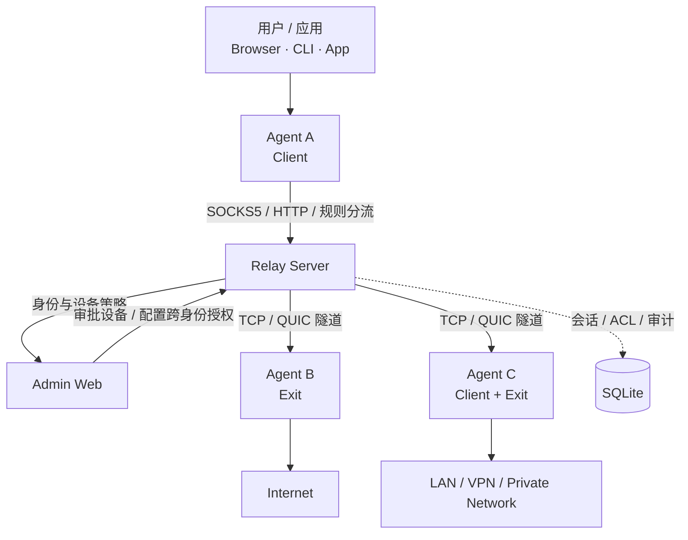
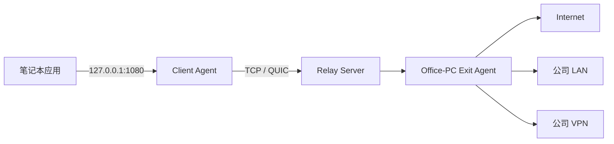
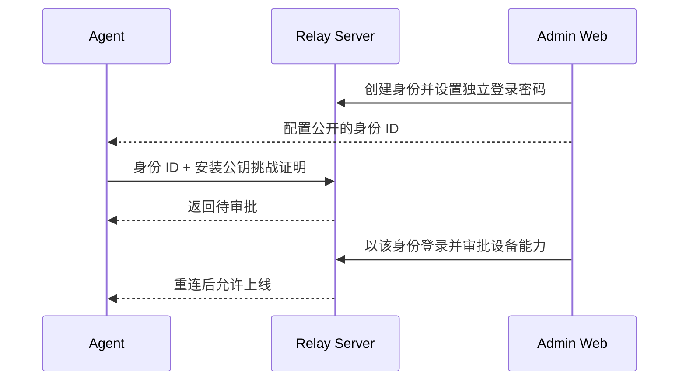
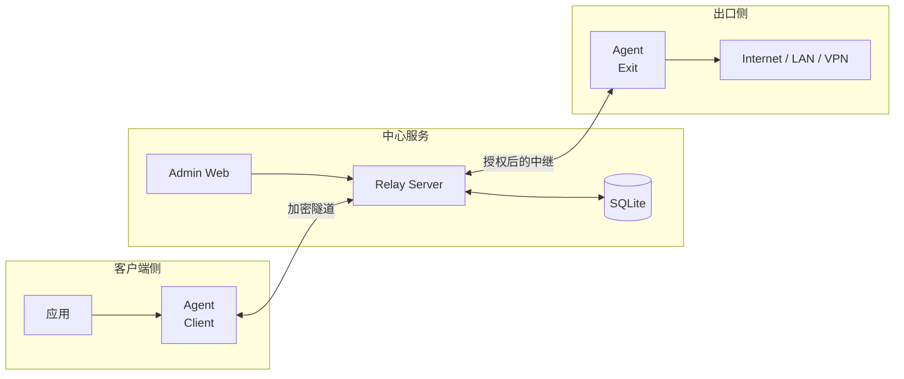
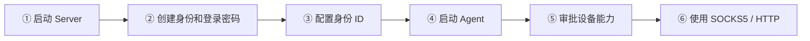
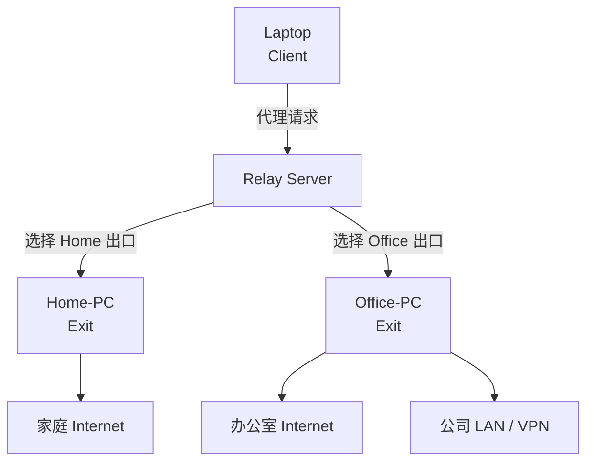
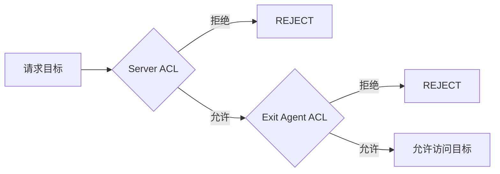
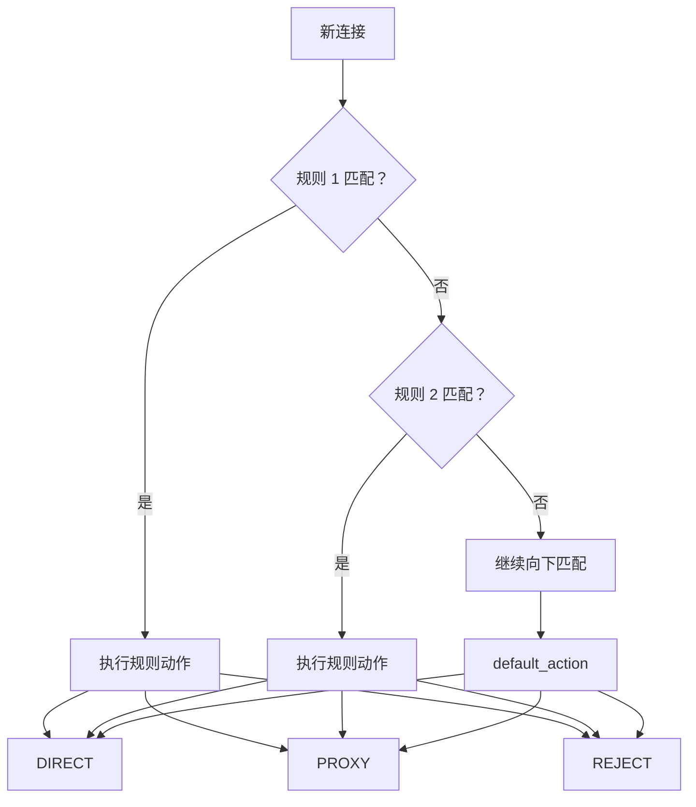
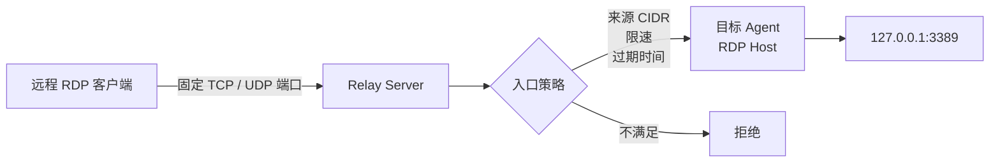

<p align="center">
  
</p>

<h1 align="center">RelayProxy</h1>

<p align="center">
  面向个人、多设备和小型私有网络的自建中继代理系统
</p>

<p align="center">
  <code>TCP / QUIC</code>
  ·
  <code>SOCKS5 / HTTP</code>
  ·
  <code>多出口</code>
  ·
  <code>规则分流</code>
  ·
  <code>身份隔离</code>
  ·
  <code>Admin Web</code>
</p>

RelayProxy 由一个中心 **Relay Server** 和多个 **Relay Agent** 组成。Agent 可以作为本地代理客户端，也可以作为出口节点；设备使用公开的身份 ID 加入隔离空间，并用本机安装私钥完成挑战签名。Server 负责首次接入审批、设备能力、跨身份授权、会话协调、流量中继和 Web 管理。

> 适合自建、受信任环境。公网部署时请启用 TLS、设置强管理密码、限制防火墙端口，并谨慎开放私网、回环地址和 RDP 入口。

## 适合做什么

| 场景 | 说明 |
| --- | --- |
| 🌐 远程出口 | 让笔记本通过家里或办公室电脑访问网络 |
| 🏢 内网 / VPN 访问 | 通过处于公司 LAN 或 VPN 中的 Exit Agent 访问内部资源 |
| 🧭 多出口切换 | 在 Home / Office / Cloud 等多个出口之间切换 |
| 🔀 按规则分流 | 按进程、域名/IP、端口和协议选择 DIRECT / PROXY / REJECT |
| 🛡️ 身份授权 | 首次设备需由所属身份审批；同身份直接使用，跨身份在目标设备上按身份和功能授权 |
| 🖥️ 图形化管理 | Windows Wails GUI + Agent 本地 Web + Server Admin Web |
| 📊 运行监控 | 查看在线设备、活动会话、实时连接、日志和流量 |
| 🖥️ 一键远程桌面 | Agent GUI 只展示后台授权的 RDP 主机，P2P 优先并自动回退 Relay |
| 🔐 受控 RDP 入口 | 为指定设备创建带来源限制、限速和过期时间的入口 |

## 一图看懂


```mermaid
flowchart TB
    U["用户 / 应用<br/>Browser · CLI · App"] --> A1["Agent A<br/>Client"]
    A1 -->|"SOCKS5 / HTTP / 规则分流"| S["Relay Server"]

    S -->|"身份与设备策略"| ADM["Admin Web"]
    ADM -->|"审批设备 / 配置跨身份授权"| S

    S -->|"TCP / QUIC 隧道"| A2["Agent B<br/>Exit"]
    S -->|"TCP / QUIC 隧道"| A3["Agent C<br/>Client + Exit"]

    A2 --> NET["Internet"]
    A3 --> LAN["LAN / VPN / Private Network"]

    S -. "会话 / ACL / 审计" .-> DB[("SQLite")]
```

### 一个典型流量路径


```mermaid
flowchart LR
    APP["笔记本应用"] -->|"127.0.0.1:1080"| C["Client Agent"]
    C -->|"TCP / QUIC"| S["Relay Server"]
    S --> E["Office-PC Exit Agent"]
    E --> I["Internet"]
    E --> L["公司 LAN"]
    E --> V["公司 VPN"]
```

## 首次接入流程


```mermaid
sequenceDiagram
    participant A as Agent
    participant S as Relay Server
    participant W as Admin Web

    W->>S: 创建身份并设置独立登录密码
    W-->>A: 配置公开的身份 ID
    A->>S: 身份 ID + 安装公钥挑战证明
    S-->>A: 返回待审批
    W->>S: 以该身份登录并审批设备能力
    S-->>A: 重连后允许上线
```

身份只用于隔离，不承载能力。Agent 填写公开的身份 ID；设备能力单独记录并在首次审批或后续编辑时勾选。同一身份的已审批设备可直接使用彼此提供的出口和 RDP，但访问方与目标设备仍必须具备对应能力。目标设备的所属身份可以在该设备详情中，把 `proxy.use`、`rdp.connect` 等能力授权给其他身份，也可以编辑或删除授权。历史设备必须先显式分配身份，之后才能用匹配的身份 ID 重连。

## 文档导航

- [主要功能](#2-主要功能)
- [支持平台](#3-平台)
- [快速开始](#4-快速开始)
- [SOCKS5--HTTP](#5-使用-socks5--http-代理)
- [出口节点](#6-出口节点)
- [访问权限](#7-出口节点访问权限)
- [路由分流](#8-路由分流)
- [Windows 系统透明代理](#9-windows-系统透明代理)
- [Agent GUI / Web](#10-agent-gui-与本地-web-管理)
- [Server Web](#11-server-web-管理)
- [RDP 连接](#12-rdp-连接)
- [TLS 与 QUIC](#13-tls-与-quic)
- [完整配置](#14-agent-完整配置示例)
- [命令行](#15-agent-命令行)
- [编译](#17-编译)
- [常见问题](#20-常见问题)

---

## 1. 工作方式

RelayProxy 的核心不是“把所有设备直接互相暴露”，而是让设备先连接中心 Server，由 Server 管理身份、能力和流量路径。


```mermaid
flowchart LR
    subgraph ClientSide["客户端侧"]
        APP["应用"]
        PA["Agent<br/>Client"]
        APP --> PA
    end

    subgraph Control["中心服务"]
        RS["Relay Server"]
        AW["Admin Web"]
        DB[("SQLite")]
        AW --> RS
        RS <--> DB
    end

    subgraph ExitSide["出口侧"]
        PE["Agent<br/>Exit"]
        OUT["Internet / LAN / VPN"]
        PE --> OUT
    end

    PA <-->|"加密隧道"| RS
    RS <-->|"授权后的中继"| PE
```

角色关系可以简单理解为：

- **Client**：发起代理请求。
- **Exit**：替其他设备访问最终目标。
- **Client + Exit**：一台 Agent 同时具备两种能力。
- **Server**：不直接充当任意网络出口，主要负责认证、授权、协调和中继。

---

## 2. 主要功能

### Relay Server

- TCP 隧道。
- QUIC 隧道。
- TLS 加密。
- SQLite 持久化。
- 身份、独立登录与设备归属。
- 设备能力授权。
- 在线设备与会话管理。
- 出口节点管理。
- 中央目标访问 ACL。
- 连接审计与流量统计。
- RDP 公网入口。
- Admin Web 管理控制台。
- 管理密码修改。
- 在线修改服务配置。
- 删除、撤销设备。
- Webhook 消息推送、验证码提取与消息投递历史。

### Relay Agent

- SOCKS5 代理。
- HTTP 代理。
- 自动选择或指定出口节点。
- Client / Exit 组合能力。
- 按规则路由：
  - DIRECT
  - PROXY
  - REJECT
- 按进程匹配。
- 按域名 / IP 匹配。
- 按端口匹配。
- 按 TCP / UDP 匹配。
- 实时连接监控。
- 本地运行日志。
- Windows Wails 原生 GUI。
- 本地 Web 管理页面。
- 系统托盘和开机自启。
- 消息历史、验证码中央弹窗与一键复制。

---

## 3. 平台

| 平台 | Server | Agent | GUI | SOCKS5 / HTTP | 系统透明代理 |
| --- | --- | --- | --- | --- | --- |
| Windows x64 | ✅ | ✅ | ✅ | ✅ | ✅ |
| Windows ARM64 | ✅ | ✅ | ✅ | ✅ | — |
| Linux x64 | ✅ | ✅ | Web | ✅ | ✅ |
| Linux ARM64 | ✅ | ✅ | Web | ✅ | ✅ |
| macOS Intel | — | ✅ | Web / App | ✅ | 需要对应系统扩展环境 |
| macOS Apple Silicon | — | ✅ | Web / App | ✅ | 需要对应系统扩展环境 |

Windows ARM64 仍然可以正常使用 Relay 隧道、SOCKS5、HTTP、本地 Web 管理和出口节点能力。

---

# 4. 快速开始

下面先给出一个最容易验证连通性的 **局域网测试配置**。


```mermaid
flowchart LR
    S1["① 启动 Server"] --> S2["② 创建身份和登录密码"]
    S2 --> S3["③ 配置身份 ID"]
    S3 --> S4["④ 启动 Agent"]
    S4 --> S5["⑤ 审批设备能力"]
    S5 --> S6["⑥ 使用 SOCKS5 / HTTP"]
```

下面假设 `relay.example.com` 已解析到 Server，证书由系统信任。身份 ID 是公开标识，但公网部署仍建议使用 TLS 保护隧道内容；局域网自建 CA 时，需要先把 CA 安装到 Agent 的系统信任库，并使用证书中匹配的主机名。

假设：

```text
Relay Server: relay.example.com
Tunnel Port:  20000
Admin Port:   20001
```

## 4.1 启动 Server

创建：

```yaml
# relay-server.yaml

server:
  tls_enabled: true

  quic:
    listen: ":20000"

  tls:
    listen: ":20000"

  admin:
    listen: ":20001"
    tls_enabled: false

  cert_file: "cert/server.crt"
  key_file: "cert/server.key"

database:
  driver: sqlite
  dsn: relayproxy.db

tunnel:
  heartbeat_sec: 15
  max_connections_per_device: 1024
  max_connections: 2048

rdp:
  lease_sec: 60
  rendezvous_listen: ""
  rendezvous_advertise: ""

  ingress:
    enabled: false
    listen: "0.0.0.0:0"
    port_start: 20100
    port_end: 20200
    source_cidrs: []
    rate_limit_per_minute: 120

relay_acl:
  allow_internet: true
  allow_private_network: false
  allow_loopback: false

  access:
    mode: ""
    domains: []
    cidrs: []

logging:
  level: info
```

### Linux

```bash
export RELAY_ADMIN_PASSWORD='change-this-password'

chmod +x relay-server

./relay-server -config relay-server.yaml
```

### Windows PowerShell

```powershell
$env:RELAY_ADMIN_PASSWORD = "change-this-password"

.\relay-server.exe -config .\relay-server.yaml
```

然后访问：

```text
http://relay.example.com:20001
```

默认管理员账号：

```text
admin
```

如果未设置 `RELAY_ADMIN_PASSWORD`，Server 首次初始化数据库时会生成随机管理密码，并在控制台中显示一次。

建议正式部署时显式设置管理密码。

---

## 4.2 创建身份和独立登录

登录 Server 管理页面，在「身份管理」填写自定义登录用户名、显示名称和初始密码。Server 会自动生成 16 位小写字母数字身份 ID，供 Agent 和 Android 连接；登录用户名与身份 ID 相互独立。创建身份时不配置能力；身份只建立隔离边界，设备能力在审批时单独勾选，之后也可以编辑。

常见能力用途：

| 能力 | 作用 |
| --- | --- |
| Client | 允许设备通过其他出口访问网络 |
| Exit | 允许其他设备使用本机作为出口 |
| RDP Controller | 允许本机查看已授权的 RDP 主机并发起连接 |
| RDP Host | 允许本机提供 RDP 目标服务 |
| RDP Public | 允许为该设备创建公网 RDP 入口 |

## 4.3 配置第一个 Agent

创建：

```yaml
server:
  address: relay.example.com
  tcp_port: 20000
  quic_port: 20000
  tls_enabled: true

device:
  identity_id: a1b2c3d4e5f6g7h8
  name: My-PC

transport:
  mode: tcp_only
```

Windows GUI 可以直接启动：

```powershell
.\relay-agent-gui.exe
```

在「连接与身份」中填写 Server 为该身份自动生成的 16 位身份 ID。设备会使用自动生成的安装私钥完成挑战签名；首次连接显示待审批，使用该身份自定义用户名登录 Server 后，在「待审批设备」中勾选设备能力并批准。

命令行运行时，身份 ID 直接写在配置文件的 `device.identity_id` 中：

```powershell
.\relay-agent.exe --no-gui --config .\relay-agent.yaml
```

Linux：

```bash
chmod +x relay-agent
./relay-agent --no-gui --config ./relay-agent.yaml
```

Agent 首次使用身份 ID 连接后进入该身份的待审批列表。批准的能力只能从设备实际声明的功能中选择；管理员之后收紧设备能力时，重连不会自行恢复已移除的能力。身份被禁用、设备被拒绝或撤销，或设备已绑定到另一身份时，连接都会被拒绝。

---

# 5. 使用 SOCKS5 / HTTP 代理

默认本地监听：

```text
SOCKS5  127.0.0.1:1080
HTTP    127.0.0.1:8080
```

## SOCKS5

```bash
curl -x socks5h://127.0.0.1:1080 https://ipinfo.io
```

浏览器代理：

```text
SOCKS5 Host: 127.0.0.1
Port:        1080
```

建议使用远端 DNS 的 SOCKS5 模式，例如 curl 的：

```text
socks5h://
```

## HTTP

```bash
curl -x http://127.0.0.1:8080 https://ipinfo.io
```

---

# 6. 出口节点

Agent 可以同时拥有 Client 和 Exit 能力。


```mermaid
flowchart TB
    L["Laptop<br/>Client"]
    S["Relay Server"]
    H["Home-PC<br/>Exit"]
    O["Office-PC<br/>Exit"]

    L -->|"代理请求"| S
    S -->|"选择 Home 出口"| H
    S -->|"选择 Office 出口"| O

    H --> HI["家庭 Internet"]
    O --> OI["办公室 Internet"]
    O --> OL["公司 LAN / VPN"]
```

同一个 Client 可以根据默认出口或路由规则，把不同连接送往不同 Exit。

Laptop 可以选择：

```text
Home-PC
```

或者：

```text
Office-PC
```

作为出口。

Agent 配置中可以指定默认出口：

```yaml
proxy:
  default_exit_id: "dev_xxxxxxxxx"
```

如果没有指定，并且当前只有一个可用出口，客户端可以自动使用该出口。

GUI 中也可以直接选择出口节点。

---

# 7. 出口节点访问权限

出口权限由两层控制共同决定，最终结果取二者交集：


```mermaid
flowchart LR
    R["请求目标"] --> SA{"Server ACL"}
    SA -->|拒绝| X1["REJECT"]
    SA -->|允许| EA{"Exit Agent ACL"}
    EA -->|拒绝| X2["REJECT"]
    EA -->|允许| OK["允许访问目标"]
```

换句话说：

```text
最终允许 = Server ACL ∩ Exit Agent ACL
```

也就是说，两边都允许时请求才会真正放行。

## Server ACL

例如允许公网和私网：

```yaml
relay_acl:
  allow_internet: true
  allow_private_network: true
  allow_loopback: false
```

如果只允许指定目标：

```yaml
relay_acl:
  allow_internet: true
  allow_private_network: true
  allow_loopback: false

  access:
    mode: allow
    domains:
      - "*.example.com"
      - ".corp.example"

    cidrs:
      - "10.0.0.0/8"
      - "192.168.1.0/24"
```

## Exit Agent ACL

```yaml
exit:
  enabled: true

  allow_internet: true
  allow_private_network: true
  allow_loopback: false

  access:
    mode: allow

    domains:
      - "*.example.com"

    cidrs:
      - "10.0.0.0/8"
```

如果想通过办公室电脑访问公司 LAN 或 VPN 网络，需要同时允许 Server 和对应 Exit Agent 的：

```text
private_network
```

---

# 8. 路由分流

RelayProxy 使用组合路由规则决定连接如何处理。


```mermaid
flowchart TD
    C["新连接"] --> R1{"规则 1 匹配？"}
    R1 -->|否| R2{"规则 2 匹配？"}
    R1 -->|是| A1["执行规则动作"]
    R2 -->|否| RN["继续向下匹配"]
    R2 -->|是| A2["执行规则动作"]
    RN --> D["default_action"]

    A1 --> DIRECT["DIRECT"]
    A1 --> PROXY["PROXY"]
    A1 --> REJECT["REJECT"]
    A2 --> DIRECT
    A2 --> PROXY
    A2 --> REJECT
    D --> DIRECT
    D --> PROXY
    D --> REJECT
```

支持三种动作：

```text
DIRECT
PROXY
REJECT
```

规则按顺序匹配，使用第一条命中的规则。

示例：

```yaml
routing:
  mode: rule
  default_action: DIRECT

  rules:
    - name: Chrome HTTPS
      enabled: true

      processes:
        - "chrome*"
        - "*msedge.exe"

      targets:
        - "*.example.com"
        - "203.0.113.*"

      ports:
        - "443"
        - "8000-9000"

      protocols:
        - tcp

      action: PROXY
      exit_id: "office-exit"
```

规则字段之间为 **AND**：

```text
process
AND target
AND port
AND protocol
```

同一字段中的多个值为 **OR**。

例如：

```yaml
processes:
  - chrome.exe
  - msedge.exe
```

表示：

```text
chrome.exe OR msedge.exe
```

支持：

- 精确进程名。
- 进程路径。
- `*` / `?` 通配。
- 域名。
- IPv4 / IPv6。
- CIDR。
- 单端口。
- 端口范围。
- TCP / UDP。

---

# 9. Windows 系统透明代理

Windows x64 可以将：

```yaml
network:
  mode: divert
```

启用为系统级透明代理。

GUI 中对应：

```text
代理与路由
→ 本地代理
→ 系统透明代理
```

该模式需要管理员权限。

它可以将应用新建的 TCP / UDP 流量交给统一路由规则：

```text
应用
 ↓
透明捕获
 ↓
路由规则
 ├── DIRECT
 ├── PROXY -> Relay Server -> Exit
 └── REJECT
```

透明代理会旁路观察匹配成功的 A / AAAA DNS 查询与应答，并维护短期的 IP → 域名关联。对于 PROXY 流量，如果目标 IP 只有一个明确、未过期的 DNS 域名关联，RelayProxy 会把该域名而不是客户端本地解析出的 IP 交给 Exit，由 Exit 在自己的网络环境重新解析并建立 TCP / UDP 连接；共享 IP、关联冲突、关联缺失时仍使用原始目标 IP。DIRECT 流量始终保持原始 IP，不改变本地直连语义。

可以通过：

```yaml
network:
  mode: divert

  exclude_processes:
    - updater.exe
    - backup.exe
```

排除特定进程。

Windows ARM64 当前建议使用 SOCKS5 / HTTP 模式。

---

# 10. Agent GUI 与本地 Web 管理

### 界面分工

| 界面 | 主要用途 |
| --- | --- |
| 🖥️ Windows Wails GUI | 日常配置、出口切换、路由规则、实时连接、日志 |
| 🌐 Agent 本地 Web | 无桌面环境或浏览器管理，默认仅回环访问 |
| 🛠️ Server Admin Web | 身份与独立登录、设备归属、跨身份授权、出口与会话、RDP 入口、服务配置 |

## Windows GUI

Windows 桌面客户端使用 **Wails v3 + WebView2**，继续复用 Agent Web 的界面与业务桥接能力。

启动：

```powershell
.\relay-agent-gui.exe
```

GUI 支持：

- 连接状态。
- Server 配置。
- 设备身份。
- 出口选择。
- SOCKS5 / HTTP。
- 系统代理设置。
- 路由规则。
- Exit 权限。
- 实时连接。
- 日志。
- 自动启动。
- 浅色 / 深色主题。
- 系统托盘。

默认关闭窗口时最小化到托盘。

## 本地 Web

Agent Web、Windows Wails GUI 与 macOS 桌面管理窗口共用同一套 React UI。浏览器中的配置保存、出口切换、分流规则、RDP、消息及实时监控仍通过 Agent 本地 HTTP API 执行，不依赖 Wails Runtime。

正式发布请使用 `scripts/build.sh` 或 `scripts/build.ps1`，构建脚本会**先编译 React 前端，再编译所有平台的 Agent**，将 Vite 产物直接嵌入二进制，无需部署额外的静态文件。若直接使用 `go build`，应先在 `agent/gui/frontend` 中执行 `npm install && npm test && npm run build`；否则仅会使用 Go 开发构建的旧版后备页面。

原有 `/connections` 链接在 React 产物存在时会进入新版“实时监控”页面；`/?page=monitor` 也可直接打开该页面。

Agent 默认同时启动：

```text
http://127.0.0.1:9090
```

可通过配置修改：

```yaml
web:
  enabled: true
  listen: 127.0.0.1
  port: 9090
```

局域网监听也可以不配置令牌。例如：

```yaml
web:
  enabled: true
  listen: 0.0.0.0
  port: 9090
```

此时局域网中任何能访问该端口的设备都可以读取和修改 Agent 配置，请仅在受信网络中使用。若需要鉴权，可以选择配置至少 32 字节的随机令牌：

```yaml
web:
  enabled: true
  listen: 0.0.0.0
  port: 9090
  token: "请替换为至少 32 字节的高强度随机值"
```

配置令牌后，首次访问使用 `http://<Agent-IP>:9090/?token=<令牌>`；验证后令牌会从地址栏移除并保存到 HttpOnly Cookie。内置 Web 服务使用 HTTP，建议只在受信网络、VPN 或受保护的反向代理后开放，避免管理数据或令牌被窃听。

也可以关闭：

```yaml
web:
  enabled: false
```

命令行临时关闭：

```bash
relay-agent --no-web
```

---

# 11. Server Web 管理

Server Admin Web 用于：

- 查看在线设备。
- 查看出口节点。
- 查看活跃会话。
- 创建身份、设置独立登录密码。
- 独立配置每台设备的能力。
- 迁移历史设备的身份归属。
- 在每台目标设备上，管理授予其他身份的代理与 RDP 能力。
- 撤销设备。
- 删除设备。
- 管理 RDP 公网入口。
- 修改服务配置。
- 修改管理员密码。
- 查看流量统计。

## 11.1 推送渠道、验证码识别与内容分流

Server 的 **消息** 页面可以配置推送渠道。每个渠道可以包含：

- 渠道名称与渠道 ID。
- 默认 / 兜底目标设备，或“全部设备”。
- 是否启用 RelayProxy 默认验证码识别。
- 0～32 条自定义验证码识别规则。
- 0～64 条按消息正文匹配的内容分流规则。

绑定“全部设备”时，每次推送都会动态选择当前所有已批准设备，因此之后新增并批准的设备也会自动进入该目标组。

外部系统不需要传设备 ID，也不需要 Token，只需要把 **渠道 ID 拼在 URL 中**。

推送 HTTP 接口监听在 **中继 TCP 端口**（`server.tls.listen`），不是 Admin Web 的 `server.admin.listen`。同一个 TCP 端口会自动区分 RelayProxy yamux 隧道与 HTTP 请求；QUIC / UDP 中继保持原协议不变。

例如中继配置为：

```yaml
server:
  tls_enabled: true
  tls:
    listen: ":443"
  admin:
    listen: ":8443"
```

则推送使用 `https://relay.example.com/api/v1/push/{channelId}`，而不是管理端口 `:8443`。如果中继 TCP 监听 `:21000`，则使用 `https://relay.example.com:21000/api/v1/push/{channelId}`。关闭中继 TLS 时，协议对应改为 `http://`。

### GET

```text
GET /api/v1/push/{channelId}?message=您的验证码为482931&title=登录验证码
```

例如：

```bash
curl "https://relay.example.com/api/v1/push/login-code?message=%E6%82%A8%E7%9A%84%E9%AA%8C%E8%AF%81%E7%A0%81%E4%B8%BA482931&title=%E7%99%BB%E5%BD%95%E9%AA%8C%E8%AF%81%E7%A0%81"
```

GET 支持：

- `message`：消息正文。
- `content`：可代替 `message`。
- `title`：可选标题。
- `source`：可选来源。

### POST

```text
POST /api/v1/push/{channelId}
Content-Type: application/json
```

```json
{
  "title": "登录验证码",
  "message": "您的登录验证码为 482931，5 分钟内有效",
  "source": "sms-gateway"
}
```

POST 同样支持 `content` 代替 `message`，也可以从 URL 查询参数读取 JSON 中没有提供的字段。

### 默认验证码识别

默认识别要求正文中出现验证码语义，并在附近找到 4～8 位字母数字组合。候选必须至少包含一个数字，因此既支持纯数字，也支持类似 `G931`、`A7K9P2` 的验证码。

默认关键词包含：

```text
验证码 / 校验码 / 动态码 / 动态密钥 / 安全码 / 短信码
附加码 / 登录附加码 / 认证码 / 口令码
verification code / verify code / one time password / one time code
OTP / passcode / security code / authentication code
```

例如下面两条都会识别：

```text
512360是您的4A系统动态密钥，请遵守法规...
=> 512360

【四川移动管信系统】您的EIP登录附加码是：G931，在当日有效。
=> G931
```

### 自定义验证码规则

每个渠道可以额外配置自定义规则。**自定义规则优先于默认规则**，适合不同厂商的特殊短信格式。

每条规则可以配置：

- 名称。
- 一个或多个关键词。
- Go 正则表达式。
- 最大关键词距离。
- 是否区分大小写。

正则包含捕获组时返回第一个非空捕获组；没有捕获组时返回整个匹配。例如：

```text
关键词：访问密令
正则：ID-([A-Z0-9]{4})
消息：系统通知：访问密令 ID-X7P3
结果：X7P3
```

如果不填写正则，只配置关键词，会沿用默认的 4～8 位字母数字候选格式。

### 内容分流

同一个渠道可以配置多条内容分流规则。规则只匹配**消息正文**，按界面中的配置顺序执行，**第一条命中的规则生效**。

每条规则支持：

- `contains`：正文包含指定文本。
- `regex`：使用 Go 正则匹配正文。
- 是否区分大小写。
- 指定一个或多个设备。
- 或命中后推送到全部已批准设备。

例如：

```text
规则 1：
  正文包含 "4A系统"
  -> 设备 1

规则 2：
  正文包含 "EIP"
  -> 设备 2
```

收到：

```text
512360是您的4A系统动态密钥...
```

只会走规则 1 的目标设备；收到：

```text
您的EIP登录附加码是：G931
```

只会走规则 2 的目标设备。

如果没有任何分流规则命中，则使用渠道的默认 / 兜底设备。如果渠道配置了分流规则但没有兜底设备，且本次消息没有命中任何规则，接口返回 `409 Conflict`，不会把消息误推送到其他设备。

Server 收到请求后的处理顺序：

1. 根据 URL 中的渠道 ID 读取渠道。
2. 解析消息正文。
3. 按顺序匹配内容分流规则并确定目标设备；未命中则使用兜底设备。
4. 先执行自定义验证码规则，再执行默认验证码规则。
5. 持久化消息、命中的分流规则和设备投递记录。
6. 并行推送到在线目标设备。
7. 记录每台设备的投递状态。

投递状态：

- `delivered`：Agent 已确认接收。
- `offline`：目标设备当前离线。
- `failed`：在线但投递失败。
- `pending`：等待投递状态更新。

Server Web 的 **消息** 页面可以管理渠道、验证码规则、内容分流规则和目标设备，并查看历史消息、验证码、渠道 ID、命中的分流规则和每台设备的投递结果。Agent GUI 的 **消息** 页面保存本设备最近收到的消息，并支持搜索、筛选和复制验证码。

Windows GUI 收到验证码时会显示独立的屏幕中央悬浮卡片；主窗口即使缩到托盘也可以显示。连续收到多个验证码时会进入弹窗队列，用户可逐个复制或稍后处理。

> 推送接口按渠道 ID 直接公开调用，不做 Token 校验。公网部署时，渠道 URL 应按你的网络边界和暴露范围管理。

---

设备支持两个不同操作：

### 撤销

```text
撤销设备授权
```

效果：

- 立即断开当前连接。
- 保留设备身份。
- 同一个安装身份继续使用身份 ID 连接时仍保持撤销状态。

### 删除

```text
删除设备
```

效果：

- 立即断开当前连接。
- 删除设备记录。
- 删除相关授权。
- 删除相关 RDP 关系。
- 删除安装身份记录。
- 客户端随后可使用身份 ID 重新发起申请，并等待身份管理员审批。

---

# 12. RDP 连接

## 12.1 Agent GUI 一键连接

Agent GUI 的「远程桌面」页只使用 Server 下发的授权清单，不接受任意设备 ID 或目标地址。部署步骤：

1. 在 Server Web 为发起方设备启用 `RDP Controller`。
2. 为被连接方设备启用 `RDP Host`。同身份设备可直接连接；跨身份时，在目标设备的身份授权中向发起方身份勾选 `RDP`。
3. 在 Agent GUI 打开「远程桌面」，在线目标会显示「一键连接」。
4. Windows 桌面端建立本机回环入口后会自动打开 `mstsc`；其他平台可复制页面显示的本地入口交给 RDP 客户端。

连接同时支持 TCP 与 UDP。Agent 优先协商 P2P 直连；直连不可用时自动回退到已认证的 Relay 数据面。页面会显示实际的 TCP / UDP 路径和 UDP 状态。

授权清单和在线状态会随隧道心跳刷新。管理员收紧相关设备能力、删除跨身份授权或关闭目标服务后，目标会从列表移除，正在使用该目标的本地 RDP 入口也会关闭。即使 Agent 尚未收到下一次刷新，Server 在每次 RDP 数据流建立时仍会重新执行授权检查。

目标 Agent 默认连接本机 `127.0.0.1:3389`。目标地址不会下发给 controller，因此 RDP 授权不能被转换成任意端口转发。跨 NAT 使用 P2P 时建议配置 Server 的 `rdp.rendezvous_listen` 与可访问的 `rdp.rendezvous_advertise`。

## 12.2 Server 公网入口

RelayProxy 可以由 Server 为已经授权的 RDP Host 创建受控公网入口。


```mermaid
flowchart LR
    R["远程 RDP 客户端"] -->|"固定 TCP / UDP 端口"| S["Relay Server"]
    S --> G{"入口策略"}
    G -->|"来源 CIDR<br/>限速<br/>过期时间"| H["目标 Agent<br/>RDP Host"]
    H --> D["127.0.0.1:3389"]
    G -->|不满足| X["拒绝"]
```

默认：

```yaml
rdp:
  ingress:
    enabled: false
```

建议保持默认关闭，需要时再启用。

示例：

```yaml
rdp:
  lease_sec: 60

  rendezvous_listen: ":3478"
  rendezvous_advertise: "relay.example.com:3478"

  ingress:
    enabled: true
    listen: "0.0.0.0:0"

    port_start: 20100
    port_end: 20200

    source_cidrs:
      - "203.0.113.0/24"

    rate_limit_per_minute: 120
```

然后在 Server Web：

```text
RDP 公网入口
→ 创建入口
→ 选择目标设备
→ 设置固定或自动端口
→ 设置来源 CIDR
→ 设置限速 / 过期时间
```

公网环境强烈建议设置来源 CIDR，不要无条件暴露 RDP。

---

# 13. TLS 与 QUIC

正式部署建议：

```yaml
server:
  tls_enabled: true

  quic:
    listen: ":443"

  tls:
    listen: ":443"

  admin:
    listen: ":8443"
    tls_enabled: true

  cert_file: "/path/to/fullchain.pem"
  key_file: "/path/to/privkey.pem"
```

Agent：

```yaml
server:
  address: relay.example.com
  tcp_port: 443
  quic_port: 443
  tls_enabled: true

transport:
  mode: auto
```

传输模式：

| mode | 行为 |
| --- | --- |
| `auto` | 优先 QUIC，失败时回退 TCP |
| `quic_only` | 仅 QUIC |
| `tcp_only` | 仅 TCP |

QUIC 依赖 TLS。

如果 Server 关闭 TLS，Agent 必须同步：

```yaml
server:
  tls_enabled: false

transport:
  mode: tcp_only
```

`--insecure` 只建议用于测试自签名环境，不建议用于正式部署。

---

# 14. Agent 完整配置示例

```yaml
server:
  address: relay.example.com
  tcp_port: 443
  quic_port: 443
  tls_enabled: true

device:
  name: Work-Laptop

transport:
  mode: auto

proxy:
  socks5:
    enabled: true
    listen: 127.0.0.1
    port: 1080

  http:
    enabled: true
    listen: 127.0.0.1
    port: 8080

  default_exit_id: ""

exit:
  enabled: true
  allow_internet: true
  allow_private_network: false
  allow_loopback: false

  access:
    mode: ""
    domains: []
    cidrs: []

network:
  mode: ""

  exclude_processes:
    - relayproxy
    - relayproxy.exe
    - RelayProxy.exe

routing:
  mode: rule
  default_action: PROXY
  rules: []

gui:
  enabled: true
  minimize_to_tray: true
  start_minimized: false
  theme: system

web:
  enabled: true
  listen: 127.0.0.1
  port: 9090

logging:
  level: info
```

实际上首次安装时不需要写这么多。

最小 Agent 配置可以只有：

```yaml
server:
  address: relay.example.com
```

当 Server 使用默认的 443 端口和 TLS 时，其余选项会自动采用安全默认值。

---

# 15. Agent 命令行

查看版本：

```bash
relay-agent --version
```

指定配置文件：

```bash
relay-agent --config ./relay-agent.yaml
```

临时覆盖 Server：

```bash
relay-agent --server relay.example.com
```

指定出口：

```bash
relay-agent --exit dev_xxxxx
```

覆盖 SOCKS5：

```bash
relay-agent --socks5 127.0.0.1:1081
```

覆盖 HTTP：

```bash
relay-agent --http 127.0.0.1:8081
```

无 GUI：

```bash
relay-agent --no-gui
```

关闭本地 Web：

```bash
relay-agent --no-web
```

修改 Web 端口：

```bash
relay-agent --web-port 9091
```

Windows 最小化启动：

```powershell
.\relay-agent-gui.exe --minimized
```

---

# 16. Server 命令行

Server 主要参数：

```text
-config
```

例如：

```bash
./relay-server -config ./configs/relay-server.yaml
```

或者：

```powershell
.\relay-server.exe -config .\configs\relay-server.yaml
```

---

# 17. 编译

项目当前使用：

```text
Go 1.27.1
```

## Windows

PowerShell 5.1 或更高版本：

```powershell
.\scripts\build.ps1
```

指定版本：

```powershell
.\scripts\build.ps1 -Version "1.0.0"
```

## Linux / macOS

```bash
chmod +x scripts/build.sh

VERSION=1.0.0 ./scripts/build.sh
```

在 macOS 构建机上，`RelayProxy.app` 会使用系统 Swift 编译器生成原生 AppKit/WKWebView 窗口，并在应用包内启动 `relay-agent`。从 Linux 或 Windows 交叉构建 macOS 包时，会保留浏览器管理页作为兼容回退。

本地测试构建默认使用 ad-hoc 签名。正式分发时可设置 `MACOS_CODESIGN_IDENTITY="Developer ID Application: ..."` 生成 Hardened Runtime 签名，并在发布前按 Apple 要求完成 notarization。

构建脚本会生成跨平台产物、配置文件和 SHA256 校验清单。

主要产物：

```text
dist/
├── RelayProxy-agent-windows-amd64.zip
├── RelayProxy-<target>.zip / .tar.gz
├── SHA256SUMS.txt
│
├── windows-amd64/
│   ├── relay-agent-gui.exe
│   ├── relay-agent.exe
│   ├── relay-server.exe
│   └── windivert/
│
├── windows-arm64/
│   ├── relay-agent-gui.exe
│   ├── relay-agent.exe
│   └── relay-server.exe
│
├── linux-amd64/
│   ├── relay-agent
│   └── relay-server
│
├── linux-arm64/
│   ├── relay-agent
│   └── relay-server
│
├── darwin-amd64/
│   ├── relay-agent
│   ├── relay-server
│   └── RelayProxy.app
│
├── darwin-arm64/
│   ├── relay-agent
│   ├── relay-server
│   └── RelayProxy.app
│
├── darwin-universal/                # 仅在 macOS + lipo 环境生成
│   ├── relay-agent
│   ├── relay-server
│   └── RelayProxy.app
│
└── darwin-native/                   # 可选：xcodegen + Xcode + DEVELOPMENT_TEAM
    └── RelayProxyMacHost.app        # 内嵌 NetworkExtension
```

其中 macOS Server 是“可构建实验产物”，不改变上方平台表中的正式支持范围。原生 macOS NetworkExtension App 只会在 macOS 构建机具备 Xcode、xcodegen，并设置 `DEVELOPMENT_TEAM` 时尝试生成；缺少这些条件时会跳过，不影响其余跨平台产物。

---

# 18. 开发与测试

运行全部 Go 测试：

```bash
go test ./... -count=1
```

静态检查：

```bash
go vet ./...
```

只测试某个包：

```bash
go test ./agent/...
go test ./server/...
```

建议代码修改后至少运行：

```bash
go test ./... -count=1
go vet ./...
```

---

# 19. 目录结构

```text
RelayProxy/
├── agent/
│   ├── app/                Agent 核心
│   ├── bridge/             GUI / Web 桥接
│   ├── divert/             系统透明代理
│   ├── gui/                Agent GUI 与本地 Web
│   ├── proxy/              SOCKS5 / HTTP
│   ├── routing/            路由规则
│   └── ...
│
├── server/
│   ├── api/                Admin API
│   ├── gateway/            Relay 数据面
│   ├── rdp/                RDP 服务
│   ├── repository/         SQLite 持久层
│   ├── service/            服务层
│   ├── session/            在线会话
│   └── web/                Server Admin Web
│
├── cmd/
│   ├── relay-agent/
│   └── relay-server/
│
├── configs/
│   ├── relay-agent.yaml
│   └── relay-server.yaml
│
├── docs/
├── scripts/
└── go.mod
```

---

# 20. 常见问题

## Agent 提示“身份接入未完成”

检查客户端是否填写了 Server 生成且仍处于启用状态的 16 位身份 ID。首次连接后，使用该身份的自定义用户名登录 Server，在待审批列表中为设备勾选至少一项能力并批准。

历史设备升级时还需要在 Server Web 完成显式归属：

```text
设备管理
→ 待迁移
→ 分配身份
```

然后在客户端配置该身份的短 ID。旧记录中的审批管理员仅用于历史审计，不会自动成为连接身份。

---

## Agent 无法连接 Server

检查：

1. Server 是否已经运行。
2. TCP 端口是否放行。
3. QUIC 使用的 UDP 端口是否放行。
4. Agent 的 `tcp_port` / `quic_port` 是否与 Server 一致。
5. Server 与 Agent 的 TLS 设置是否一致。
6. 域名是否解析正确。
7. 防火墙或 NAT 是否允许对应端口。

---

## QUIC 不通但 TCP 正常

使用：

```yaml
transport:
  mode: auto
```

客户端会优先尝试 QUIC，并在需要时回退 TCP。

如果网络明确禁止 UDP，可以直接：

```yaml
transport:
  mode: tcp_only
```

---

## SOCKS5 / HTTP 能启动，但无法访问目标

依次检查：

```text
设备是否已批准
       ↓
是否存在可用 Exit
       ↓
Server ACL 是否允许
       ↓
Exit Agent ACL 是否允许
       ↓
路由规则是否为 PROXY
```

---

## 无法访问出口设备所在的局域网

Server：

```yaml
relay_acl:
  allow_private_network: true
```

对应 Exit：

```yaml
exit:
  allow_private_network: true
```

两边都需要允许。

---

## 无法访问出口设备本机服务

需要显式允许回环：

```yaml
allow_loopback: true
```

回环访问权限风险较高，只建议在明确知道目标服务用途时开启。

---

## Windows 系统透明代理无法启动

确认：

- 使用 Windows x64。
- 以管理员权限启动。
- 配置中 `network.mode` 为 `divert`。
- 安全软件没有阻止网络捕获组件。
- 重新启动 Agent 后再测试新建连接。

---

## 删除设备后为什么又自动出现

这是预期行为。

删除表示清除当前设备记录、安装身份和相关授权。

客户端再次使用身份 ID 连接时会重新生成待审批申请，不会自动恢复原授权。

如果希望禁止该安装身份重新登记，请使用：

```text
撤销设备授权
```

而不是删除。

---

# 21. 安全建议

生产环境至少建议：

1. Relay 隧道启用 TLS。
2. 使用受信任证书。
3. 设置强 `RELAY_ADMIN_PASSWORD`。
4. Admin Web 只开放给管理网络或通过防火墙限制来源。
5. 不需要时关闭 `allow_private_network`。
6. 默认保持 `allow_loopback: false`。
7. RDP 公网入口默认关闭。
8. 开启 RDP 入口时限制 `source_cidrs`。
9. 不要在公网环境使用 `--insecure`。
10. 定期备份 Server SQLite 数据库。
11. 定期检查设备列表，删除不再使用的设备。
12. 通过出口 ACL 和 Server ACL 使用最小权限原则。

---

## License

请根据仓库中的许可证文件和第三方组件许可证要求使用和分发 RelayProxy。
