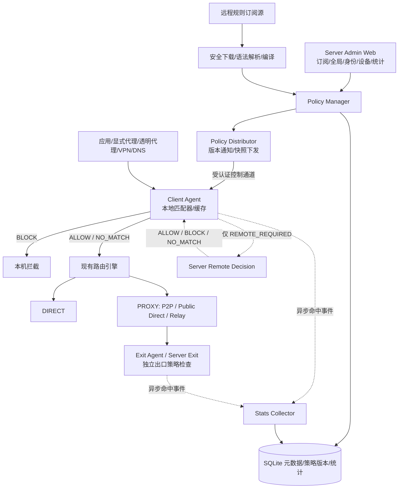

# RelayProxy AdBlock Policy Engine 设计与开发计划

> 状态：设计已确定，尚未实施（本文不代表功能已上线）
>
> 日期：2026-10-09
>
> 目标分支：`main`
>
> 设计主线：**Server 统一管理和编译规则 → Agent 本地优先判断 → 必要时 Server 远程判断 → Agent 执行拦截 → Server 统一统计**
>
> 范围：Relay Server、桌面/Linux Agent、Android、Server Admin Web、Agent React UI；iOS 仅保留后续扩展设计。
>
> 关联文档：`docs/identity-access-routing-plan.md`、`docs/proxy-p2p-direct-path-design.md`、`docs/proxy-public-direct-path-design.md`。

## 1. 目标、边界与原则

### 1.1 目标

1. 通过 Server Web 集中管理过滤规则、订阅源、身份/设备策略、例外规则和命中统计。
2. Server 下载、解析、校验、编译并发布**版本化策略快照**；Agent 校验后持久缓存、原子应用。
3. Agent 在本地处理绝大多数 DNS/域名过滤，且**无需等待 Server 往返**；仅在明确标记为需远程决策的场景使用 RPC。
4. Agent 在连接/DNS 发起侧执行过滤；Exit（含 Server-as-Exit）能独立执行其适用的出口强制策略。
5. 保留现有 `DIRECT / PROXY / REJECT`、FakeIP/Mapped DNS、SOCKS5/HTTP、透明代理、P2P QUIC、Public Direct 与 Relay 的语义和安全边界。
6. 适配 Windows、macOS、Linux、Android；可观察命中规则、触发应用、过滤位置、策略版本，且不牺牲现有设备/身份隔离。
7. 逐步上线、默认关闭、支持快速回退；旧 Agent/Server 可保持原有连接和转发能力。

### 1.2 非目标（第一阶段）

- 不做 HTTPS MITM、不安装系统根证书，不解密 TLS/QUIC 正文。
- 不提供浏览器 CSS 元素隐藏、脚本注入、网页重写、应用界面去广告。
- 不承诺拦截使用相同域名/CDN 承载内容与广告的 YouTube、流媒体应用内广告。
- 不把 IP 地址、证书 SNI 或 HTTP Host 当作始终可靠的域名来源；不因 IP 属于广告域名关联而直接封禁共享 CDN IP。
- 不以 DNS 广告拦截替代独立的 DNS 防泄漏、DoH 防绕过或系统防火墙能力。
- 不重写已有路由、出口选择、ACL、身份授权和 P2P 协议。

### 1.3 不可破坏的约束

- **Server 为控制平面**：正常广告判定无需经 Server；P2P/Public Direct 数据面不能因启用过滤而改道 Relay。
- **执行位置为 Agent/Exit**：Server 下发 `BLOCK` 不代表 Server 直接篡改终端 TCP/UDP 数据。
- **授权优先**：设备审批、身份归属、跨身份授权、Relay ACL、Exit ACL 和现有 `REJECT` 不得因广告白名单而被绕过。
- **隔离优先**：规则作用域、远程判定、统计读取/清理、订阅源管理都按所属身份授权；跨身份使用出口时不能泄露源身份的规则、日志或历史。
- **兼容优先**：旧配置文件升级可读取；没有 AdBlock 能力的旧节点维持原有行为，且不能被视为已经执行管理员的强制过滤。
- **安全默认**：过滤默认 `disabled`；策略包验证失败时保留上一个有效快照，不接受不完整策略。
- **性能优先**：本地匹配无网络 I/O；统计异步有界队列批量上报，不阻塞 DNS、Dial、转发热路径。

## 2. 已核对的现有实现和接入点

以下是截至本文编写时 `main` 可确定的现状；具体函数与模块边界在实施前以最新源码为准。

| 已有能力 | 证据/位置 | 集成建议 |
| --- | --- | --- |
| Server/Agent YAML 加载与兼容逻辑 | `internal/config/config.go` 的 `ServerConfig` / `AgentConfigFile` | 新增字段和 Normalize/Defaults/Validation；保持旧配置可用 |
| 路由配置 | `AgentConfigFile.Routing`，类型在 `agent/routing` | 广告判定独立于 `DIRECT/PROXY/REJECT`，在路由前插入策略判断 |
| 透明代理 | README 的 `network.mode: divert`；Windows x64 使用 WinDivert | 复用已识别域名、原始目标和进程元数据 |
| SOCKS5 / HTTP | README；Agent 具有客户端代理入口 | 连接建立前按原始主机名匹配 |
| P2P / Public Direct / Relay | `internal/protocol/p2p.go` 与已有设计文档 | 复用授权控制通道；不修改现有数据路径选择 |
| 身份与设备授权 | `docs/identity-access-routing-plan.md` | 用已认证会话的 identity/device ID 做策略范围和权限判断 |
| Android VPN | `android/app/src/main/kotlin/com/relayproxy/android/RelayVpnService.kt` | 在既有 `VpnService` + TUN + SOCKS5 入口接入过滤，不启动第二套 VPN |
| Android Mapped DNS | `RelayVpnService.kt`：`198.18.0.2` DNS、`198.19.0.0/16` 映射网络 | 在映射为连接目标之前保留域名并过滤，禁止将映射 IP 当公网地址 |
| Android 应用分流 | `android/app/src/main/kotlin/com/relayproxy/android/ConfigStore.kt` 的 `RoutingRuleConfig` | 复用应用包名/UID 映射；无法识别的应用按明确定义的默认策略处理 |
| Agent 管理界面 | `agent/gui/frontend` 的 React/Vite 构建链 | Windows、macOS 桌面和本地 Web 尽量共享 AdBlock 页面 |

**重要：** 此表只确认已有能力，不表示 AdBlock 的字段、消息、数据库、REST API 或界面已经存在。

## 3. 总体架构



### 3.1 模块职责

| 模块 | 推荐包/层（新建，非现有路径） | 责任 |
| --- | --- | --- |
| 公共模型与 matcher | `internal/adblock` | 规范化、规则中间表示、DNS/域名匹配、优先级、可复现单测 |
| Server 管理与编译 | `server/adblock` | 订阅下载/校验、编译、版本、策略解析与发布 |
| Server 远程判定 | `server/adblock/decision` | 认证、配额、低延迟查询、决策缓存、审计 |
| Agent 应用层 | `agent/adblock` | 快照缓存、热替换、并发匹配、执行适配、上报 |
| 共享控制协议 | `internal/protocol/adblock.go` | 新能力、消息、版本、错误和重试语义 |
| Server Web/API | 现有 Admin API 与 React 前端适配 | 配置、规则、设备状态、筛选统计 |
| Android | 既有 VPN/Go Core 接入点及 Android UI | App 身份、Mapped DNS、开关和日志 |

推荐先在 `internal/adblock` 实现**同一套纯 Go matcher**，Server 用完整策略判断，Agent 用已下发的本地快照判断；避免各端规则语义漂移。

### 3.2 两类策略，不得混淆

- **客户端过滤策略**：可由身份/设备管理员配置，目标是减少广告与跟踪请求；执行于 Client Agent，作用于 `DIRECT` 或 `PROXY` 之前。
- **出口强制策略**：由 Exit 所属身份或 Server 管理员规定的不可绕过限制；执行于最终出口的目标连接建立之前，包括 Server-as-Exit。

客户端 `ALLOW` 仅表示“客户端广告过滤同意继续”，**不构成出口准入凭证**；最终仍必须通过现有身份授权、Relay ACL、Exit ACL 与出口强制策略检查。

## 4. 规则模型、语法和优先级

### 4.1 V1 支持范围

| 类型 | 示例 | 语义 |
| --- | --- | --- |
| 精确域名 | `ads.example.com` | 仅匹配规范化域名 |
| 子域名/后缀 | `||ads.example.com^` | 依受支持的 AdGuard DNS 语法匹配域名及子域名 |
| DNS 白名单 | `@@||ads.example.com^` | 覆盖普通订阅黑名单，不覆盖强制策略/ACL |
| Hosts | `0.0.0.0 ads.example.com` | 导入为阻断域名；不作为任意 IP 重写规则 |
| 自定义域名列表 | 每行一个域名 | 阻断域名，支持注释与空行 |
| 可选应用维度 | Windows 进程名/路径、Android 包名/UID | 仅当平台可信地提供身份时匹配 |

V1 **不支持**：网页 CSS/JS 规则、扩展规则、任意正则表达式、`$redirect`、修改响应正文、任意 DNS 改写、复杂 URL 路径/查询匹配。对于 AdGuard 语法不支持的选项，应报告“已跳过条数、具体原因”，严禁默默当作有效规则。

匹配只使用可靠元数据：域名可来自 SOCKS5 域名目标、HTTP CONNECT 主机、明确的 DNS 问题、可信 FakeIP/Mapped DNS 映射或有失效期限的域名映射。对于原始 IP 目标，若无法可靠获得域名，结果为 `NO_MATCH`，而非对共享 IP 猜测封禁。

### 4.2 规范化

- 域名统一小写，剥离一个末尾根点，校验标签长度和总长度；国际化域名转为标准 ASCII/IDNA 表示。
- 域名与应用身份分开建索引。`hostname + scope + app + policy_version + query_type` 作为缓存键的必要组成部分；不同身份/设备或规则版本不得复用相同判定缓存。
- DNS A/AAAA/HTTPS/SVCB/CNAME 查询由同一策略判断；TXT/SRV 不直接返回 A 记录风格的拦截内容。
- 应用未知时不虚构进程/包名，不错误应用“仅某 App 拦截”的规则；通用域名规则仍可匹配。

### 4.3 优先级（由高到低）

1. **认证/授权、ACL、既有 `REJECT` 和系统必须阻断的流量**：广告白名单不可放行。
2. **全局/出口管理员强制 AdBlock 规则**：不接受身份/设备本地白名单绕过。
3. **管理员针对身份/设备下发的显式例外**，但只能覆盖其获授权修改的普通过滤层。
4. **身份/设备显式阻断规则**。
5. **普通订阅规则的例外（`@@`）**。
6. **普通订阅阻断规则**。
7. **未命中：`NO_MATCH`，继续已有路由**。

同层先精确/更具体匹配，再按固定优先级和稳定规则 ID 决定；编译器应保证多次编译结果一致。配置保存和远程判定都必须执行相同的作用域规则。

定义判定动作：

- `BLOCK`：广告阻断，附 `rule_id`、`source_id`、`policy_version`。
- `ALLOW`：仅本过滤层例外放行，绝不跳过后续 ACL/路由/出口强制策略。
- `NO_MATCH`：规则未命中，按现有路由处理。
- `REMOTE_REQUIRED`：本地不具备该条受控策略的最终判断能力，需要向 Server 查询；不是最终放行动作。
- `ERROR`：内部错误，按第 7 节明确的降级语义处理。

## 5. Server 策略生命周期

### 5.1 订阅管理

1. Server 由管理员配置 HTTPS 订阅源、更新周期、启用状态和作用范围。
2. 下载器进行 URL 与重定向目标校验、DNS 重绑定防护、公网/私网/环回地址限制、响应体大小限制、超时和最大并发限制，禁止访问 Server 管理接口及云元数据地址。
3. 支持 ETag/Last-Modified、压缩格式受控解压和强制字符集/UTF-8 校验；`304` 可复用上次成功版本。
4. 解析成统一 IR，记录总条数、有效条数、冲突、被忽略语法、来源与错误列表。
5. 编译时进行去重、稳定排序和规则索引构建；只有完整成功的候选策略可发布。
6. 编译失败或安全检查失败时**保留上一个可用版本**；失败不能清空线上规则。
7. 每次发布递增 `revision`，生成 `sha256`；将完整快照和元信息一起持久化，供 Agent 重连恢复。
8. 删除或禁用规则源时重新编译；不在业务请求热路径下载规则。

**建议可配置资源边界（具体值压测后确定）**：单源响应 16 MiB、单身份已编译策略 32 MiB、单源下载 20 秒、并发下载上限 4、最小更新间隔 1 小时；超限必须可观察并可回退。

### 5.2 快照内容

策略必须是**自描述、规范化、确定性编码**，至少包含：

```json
{
  "schemaVersion": 1,
  "revision": 42,
  "scope": {"identityId": "identity-from-auth", "deviceId": "device-from-auth"},
  "createdAt": "2026-10-09T13:00:00Z",
  "expiresAt": "2026-10-16T13:00:00Z",
  "compilerVersion": "adblock-compiler-v1",
  "policyHash": "sha256-hex",
  "mode": "hybrid",
  "defaultOnRemoteError": "continue",
  "localRuleSet": [],
  "remoteRuleScopes": [],
  "mandatoryRuleSet": [],
  "ruleSourceManifest": []
}
```

以上 JSON 是**拟议协议示例**，不代表已实现的字段或具体序列化格式。Server 不能信任由 Agent 上报的身份 ID；快照作用域从已认证会话中生成并绑定。`policyHash` 校验规范化快照字节（定义清楚哈希字段是否参与计算），使用现有认证控制通道保证来源和传输完整性；若需要离线签名验证，可在 V2 引入 Server 签名及公钥轮换。

### 5.3 策略分层和模式

- `local`：将该设备可执行的全部普通规则下发；本地得到最终普通过滤判定，不因 `NO_MATCH` 查 Server。
- `remote`：本地仍执行必要的强制缓存/保护规则；需判断的其他请求远程 RPC（用于调试或精细集中决策，不作为默认）。
- `hybrid`（推荐未来默认）：常规规则本地匹配；只有 `remoteRuleScopes` 明确命中、受控规则未下发或特定策略要求 Server 复核时远程判定。**完整本地规则集的普通未命中不应触发每连接远程请求。**

V1 初始上线建议 `local` 为默认、`hybrid` 可选、`remote` 受控灰度；产品稳定后再评估默认使用 `hybrid`。远程判定在所有模式下都不能替代强制出口 ACL。

## 6. 分发、同步与版本一致性

### 6.1 控制协议（拟新增）

能力协商，只有双方声明并支持时启用对应功能：

- `adblock_policy_v1`：策略通知和快照。
- `adblock_remote_decision_v1`：按需远程判定。
- `adblock_stats_v1`：批量统计。

消息类型（命名草案，可随现有控制帧结构落地）：

| 消息 | 方向 | 作用 |
| --- | --- | --- |
| `ADBLOCK_POLICY_ANNOUNCE` | Server → Agent | scope / revision / hash / size / mandatory 标志 |
| `ADBLOCK_POLICY_FETCH` | Agent → Server | 拉取完整快照或支持的块 |
| `ADBLOCK_POLICY_CHUNK` | Server → Agent | 带序号、总数、单块校验的信息 |
| `ADBLOCK_POLICY_APPLIED` | Agent → Server | 已应用版本及结果/错误 |
| `ADBLOCK_DECISION_REQUEST` | Agent → Server | 少量远程判断请求 |
| `ADBLOCK_DECISION_RESPONSE` | Server → Agent | 判定、来源、有效期和策略版本 |
| `ADBLOCK_STATS_BATCH` | Agent → Server | 有界批量命中事件/计数 |
| `ADBLOCK_STATS_ACK` | Server → Agent | 已接收批次/去重结果 |

复用现有**已认证** Agent–Server 控制通道或等价受认证管理 RPC；绝不开放匿名公共远程决策接口。若当前消息承载方式不适合大包传输，增加可恢复的分块下载；单块建议最大 256 KiB，并有总大小/序号/重试上限。

### 6.2 状态机

```text
DISABLED
  └─启用→ WAITING_POLICY
                 ├─收到合法快照→ VERIFYING → ACTIVE
                 ├─下载/校验失败→ STALE_ACTIVE(如果旧快照可用)
                 └─无旧快照→ DEGRADED
ACTIVE ─新版本通知→ DOWNLOADING → VERIFYING → ACTIVE
ACTIVE ─Server 断开→ STALE_ACTIVE
STALE_ACTIVE ─重连且校验成功→ ACTIVE
任意态 ─禁用→ DISABLED（移除普通拦截；保留适用强制访问控制）
```

- 快照写入临时文件 → 校验 scope、版本、总长度、哈希和数据结构 → matcher 预构建 → 原子替换只读快照 → 持久化最后成功版本。
- 设备重连后比较已应用 `revision/hash`，仅在必要时重传；禁止旧版本回滚覆盖新版本（除 Server 显式授权的回滚操作）。
- 收到身份撤销、设备撤销或会话失效时立即停止使用对应身份的策略和上报通道；清理相关身份敏感缓存。
- 策略关闭、强制规则撤销、跨身份授权变化应有事件级推送，并在数据面复查实际有效的授权/ACL。
- 旧 Agent 不支持时 Server Web 显示“不支持/未生效”，管理员强制规则不得误显示“已保护”。

## 7. Agent 本地判定与远程回退

### 7.1 热路径

```text
Ingress(DNS / SOCKS5 / HTTP / Transparent / Android VPN)
  → 提取域名、应用、身份会话与流量方向
  → 验证现有授权/REJECT 等不可绕过的约束
  → 已验证的本地 AdBlock matcher
      ├─ BLOCK → Agent 执行拦截并异步记录
      ├─ ALLOW/NO_MATCH → 继续原有路由
      └─ REMOTE_REQUIRED
            ├─ 命中短期决策缓存 → 执行
            ├─ Server 连接可用 → 带超时 RPC → 执行
            └─ RPC 不可用 → 使用旧缓存或明示的回退策略
  → 对 PROXY 按原选路经过 Relay/P2P/Public Direct
  → Exit 复查其强制策略及已有 ACL
```

本地 matcher 实现建议：

- 不可变结构：后缀 Trie / 域名哈希 + 规则 ID 索引；只读并发访问。
- 缓存：限制内存条数与 TTL，按 `scope / revision / domain / app / query type / direction` 隔离。
- 相同键的远程在途请求合并（singleflight），防止短时间出现数百个同域名并发 RPC。
- 规则热替换不阻塞连接建立，不破坏已建立隧道连接；是否中断既有连接属于单独的显式管理选项，V1 不自动断开。

### 7.2 Remote Decision 契约

请求示例：

```json
{
  "requestId": "random-opaque-id",
  "policyRevision": 42,
  "policyHash": "sha256-hex",
  "direction": "client",
  "domain": "ads.example.com",
  "port": 443,
  "protocol": "tcp",
  "queryType": "A",
  "appIdentity": "verified-platform-app-id",
  "reason": "REMOTE_REQUIRED"
}
```

响应示例：

```json
{
  "requestId": "random-opaque-id",
  "policyRevision": 42,
  "decision": "BLOCK",
  "ruleId": "rule-stable-id",
  "sourceId": "source-stable-id",
  "ttlSeconds": 120,
  "policyUpdateRequired": false
}
```

约束：

- Server 从认证连接确定 `identity_id`、`device_id`、授权能力与正确策略范围，忽略请求中任何可伪造的身份字段；应用身份是 Agent 报告值，可信等级必须明确。
- 仅允许规则引擎指定 `REMOTE_REQUIRED` 的查询（或显式 `remote` 模式）；防止任意 Agent 把 Server 变成通用开放域名查询服务。
- 远程判定**只匹配本地/Server 已持有的规则**，不得依据查询数据对外发起 HTTP/DNS 探测。
- 响应缓存 TTL 不得超过对应策略版本有效期；策略版本不一致时返回 `POLICY_OUTDATED` 并提示同步，不直接给可能错误的 `ALLOW`。
- 未认证、越权、超配额、格式错误、过长域名或应用字段均按可审计错误拒绝；请求和响应都必须限制字节数。
- 初始远程超时建议 150ms（配置上限 500ms），每设备 QPS 和并发限额可配置。异地高 RTT 时应通过规则下发避免使用远程判定，而不是提高所有连接的阻塞时间。

### 7.3 故障策略

| 场景 | V1 建议行为 |
| --- | --- |
| 普通规则本地匹配成功 | 按本地判定执行；与 Server 连接状态无关 |
| 本地完整策略未命中 | 直接继续原路由，不远程查询 |
| 必需远程判定超时 | 默认 `continue`（普通广告过滤 fail-open），记录降级事件 |
| 强制阻断规则已经本地匹配 | 保持阻断，不受远程超时影响 |
| Server 断线但有合法快照 | `STALE_ACTIVE`，继续本地规则；限制已过期策略使用时长并可告警 |
| Server 断线且无快照 | 普通过滤退化为透传；身份授权、路由 REJECT、ACL 不受影响 |
| 强制策略需远程确认却不可用 | 独立 `fail_closed` 或“必须先收到强制快照才准使用该出口”的明确部署策略；不得隐式放行 |
| 策略校验失败 | 不激活新策略，保留旧快照，记录详细错误 |
| 统计上报失败 | 有界队列/可选有限磁盘缓冲；满时丢弃统计，不阻塞网络转发 |

“广告过滤失败默认放行”和“强制安全策略失败不得越权放行”是两个不同承诺，配置及 UI 必须清楚区分。

## 8. DNS、FakeIP 与连接拦截语义

### 8.1 判定位置

- **DNS 接管模式**：在生成 FakeIP、转发上游解析或写入 IP→域名缓存之前先判断 Query Name；阻断时不分配 FakeIP、不更新映射缓存。
- **SOCKS5 域名目标**：直接匹配域名，避免为了广告判定增加一次本地 DNS 解析。
- **HTTP CONNECT/显式 HTTP 代理**：匹配经解析验证的目标 Host；不处理 HTTPS 正文。
- **透明代理**：优先使用可靠 DNS/FakeIP 关联；只有 IP 时不基于模糊关联封 CDN IP。
- **出口远程解析**：Client 无法识别的域名可在 Exit 获得明确目标主机名后再检查强制规则。
- **Android Mapped DNS**：`RelayVpnService` 当前使用 `198.18.0.2` 作为映射 DNS、`198.19.0.0/16` 保存映射结果。必须在映射链路保留原域名，不把保留地址交给 Exit 直接拨号，也不能凭虚假的映射 IP 判断规则。

### 8.2 各协议执行动作

| 入口 | 阻断动作 | 备注 |
| --- | --- | --- |
| DNS | 默认返回 `NXDOMAIN`；可在后续提供其他明确的阻断响应策略 | 保持请求 ID、记录类型、错误语义合法；AAAA/HTTPS/SVCB 单独测试 |
| SOCKS5 | 返回符合协议的连接拒绝并停止建立上游连接 | 不能成功建立后静默挂起 |
| HTTP 代理/CONNECT | 返回规范的 `403 Forbidden`（配置可选） | 不混同远端服务器错误 |
| 透明 TCP | 在实际数据路径返回明确失败或 RST，避免长时间黑洞超时 | 平台实现需验证不会破坏无关进程 |
| 透明 UDP | 不创建上游流、计数并可选发送明确错误（视协议/平台） | 防止虚构虚假的应用层成功响应 |
| Android VPN | 复用 TUN/SOCKS5 链路一致的拒绝语义 | 必须避免 VPN 自身循环进代理 |

### 8.3 DNS 防泄漏边界

域名广告过滤≠DNS 全面接管。应用内 DoH/DoT、HTTPS/443 DNS、环回 DNS、独立系统防火墙、DNS 记录类型兼容和 Android VPN 的 DNS 拦截验证属于独立任务。AdBlock 在**已被 RelayProxy 观察和接管的请求**上生效，UI 不得宣称“全系统/全部广告 100% 拦截”。对 `DIRECT` 要保持真实 IP 和本地直连语义，不可为广告过滤强行改变出站目标。

## 9. Client、Exit、Server-as-Exit 的职责与授权

- Client 负责其观察到的应用请求，过滤普通广告，并决定后续 `DIRECT/PROXY` 路由。
- Exit 负责来自已授权 Client 的出口请求，执行该出口的强制 AdBlock 策略、既有 Exit ACL 与实际目标连接控制。
- Server-as-Exit 复用 Exit matcher，绝不因进程同在 Server 而跳过出口检查。
- Relay Server 数据转发层不解析广告正文，不替代 Exit 的策略执行，不对 P2P 施加只能经 Relay 的限制。
- 禁止源身份管理员编辑目标出口所属身份的强制策略；Server 全局管理员的授权按现有模型执行。
- 统计中明确标记 `client / exit / server_exit`，同一次访问在两端检查时不得把两次策略检查错误计为两个“已阻断的用户请求”。

建议记录 `flow_id`（仅会话内临时关联）、`request_id`、执行节点和实际阻断点，聚合统计以“执行阻断的一端”为准。

## 10. 数据模型与 API（拟议，实施时迁移审查）

建议 SQLite 表（命名待与现有迁移约定对齐）：

| 表 | 关键字段 | 用途 |
| --- | --- | --- |
| `adblock_sources` | id、owner_identity_id（可空=全局）、name、url、enabled、etag、last_modified、last_success、error、revision | 订阅管理 |
| `adblock_rule_sets` | id、source_id、content_hash、compiler_version、rule_count、blob_ref | 编译产物与来源 |
| `adblock_policies` | id、scope_type、scope_id、mode、enabled、mandatory、revision、updated_at | 生效策略 |
| `adblock_policy_sources` | policy_id、source_id、priority | 策略绑定来源 |
| `adblock_exceptions` | id、policy_id、domain_pattern、app_pattern、action、created_by | 用户明确例外 |
| `adblock_snapshots` | scope_key、revision、sha256、blob_ref、created_at、expires_at | 最近成功发布的快照 |
| `adblock_agent_state` | device_id、identity_id、applied_revision、hash、status、last_seen、error | 同步状态 |
| `adblock_stats_daily` | day_utc、identity_id、device_id、direction、source_id、rule_id、blocked、allowed、errors | 汇总统计 |
| `adblock_events` | event_id、identity_id、device_id、occurred_at、domain_or_hash、app_id、rule_id、decision、enforcement_point、policy_revision | 可选有限时长审计 |

必须有按 `identity_id`、`device_id`、时间的查询索引，批量 upsert/去重和保留期清理；跨身份访问沿用现有 Server Admin 的鉴权方法。普通用户不能通过事件 ID 或聚合查询探测其他身份的域名或设备。

建议 REST API（**拟议路径，非现有接口**）：

```text
GET    /api/admin/adblock/overview
GET    /api/admin/adblock/sources
POST   /api/admin/adblock/sources
PATCH  /api/admin/adblock/sources/{id}
DELETE /api/admin/adblock/sources/{id}
POST   /api/admin/adblock/sources/{id}/refresh
GET    /api/admin/adblock/policies
PUT    /api/admin/adblock/policies/{scopeType}/{scopeId}
POST   /api/admin/adblock/policies/preview
GET    /api/admin/adblock/devices
GET    /api/admin/adblock/events
GET    /api/admin/adblock/stats
DELETE /api/admin/adblock/events
```

所有修改 API 采用 `revision/If-Match` 乐观并发控制；`preview` 返回匹配解释和来源，不在预览阶段进行真实 DNS/TCP 请求；删除日志与订阅源均需按身份授权、审计并要求确认。Agent 本地 Web 的 AdBlock 页面通过既有 Agent 本地 HTTP API 接入，不直接持有 Server 管理员凭据。

## 11. 统计、监控与隐私

### 11.1 事件字段

```json
{
  "eventId": "uuid",
  "timestamp": "2026-10-09T13:00:00Z",
  "policyVersion": 42,
  "direction": "client",
  "enforcementPoint": "dns",
  "decision": "BLOCK",
  "ruleId": "rule-1",
  "sourceId": "source-1",
  "deviceId": "inferred-or-server-authorized",
  "appId": "optional",
  "domain": "optional-privacy-setting",
  "durationMs": 0,
  "result": "enforced"
}
```

Server 根据已认证会话绑定设备、身份，不接受 Agent 自报的跨身份 ID。批量消息含 `batch_id`、有界事件数组、计数摘要和时间窗；Server 幂等处理重试。

### 11.2 统计口径

- 总查询/连接次数、实际拦截次数、观察到的允许次数、规则命中次数、远程判定次数/超时/错误、策略更新时间及版本落后设备数。
- “命中”≠“拦截”，“检查”≠“用户请求数”；对 Client/Exit 双检、DNS 多类型查询和重试明确去重口径。
- 实时监控显示动作、命中规则、来源、执行端和规则版本；不把广告阻断简单混成现有路由 `REJECT`。
- 默认仅保存聚合统计，详细域名/应用审计为可关闭选项并设保留期（建议 7 天）；按身份隔离查询、清理与导出。
- 队列满或离线时统计可降级，不得反向阻塞数据面。采样、批大小、落盘容量及保留期要可配置。

## 12. Web/GUI 交互

### 12.1 Server Admin Web：新增「广告过滤」导航

1. **概览**：总请求、实际拦截、拦截率、规则版本、订阅更新状态、启用设备数、远程判定延迟/错误。
2. **规则订阅**：添加/编辑/启停/删除/手动更新，显示下载状态、有效条数、忽略条数及具体错误。
3. **身份策略**：继承全局策略、勾选规则源、例外规则、强制策略与远程模式。
4. **设备策略**：是否继承身份策略、例外项、Agent 当前支持能力、已应用版本、上次同步、健康状态。
5. **拦截日志**：按身份、设备、应用、域名、规则源、动作、执行端、时间筛选和分页；支持按权限清理。
6. **规则调试**：输入域名/应用/身份/设备/方向，显示最终判定与逐层匹配解释，不实际访问目标。

交互注意：新增规则后立即显示在列表可见位置并反馈最终编译/发布结果，避免“提交成功但看不到”；所有筛选器使用适合桌面/移动端的流式布局，保持可滚动；明确区分“已保存”“已编译”“已下发”“Agent 已应用”。

### 12.2 Agent React GUI / 本地 Web

新增「广告过滤」页面：设备本机状态、继承的策略范围、启用/停用（受强制策略限制）、快照版本、最近同步时间、命中排行、例外规则编辑和拦截日志。若 Server 策略禁止本地覆盖，控件应只读并注明来源。所有操作通过 Agent 的现有 API / 配置体系实现，避免桌面 GUI 与 Web 出现两套逻辑。

### 12.3 Android

现有原生设置中增加独立「广告过滤」入口，显示 VPN 开启时覆盖哪些 App、规则同步状态、拦截统计与例外；仅 Exit 运行时展示“出口过滤”而非误称“本机所有 App 已过滤”。Android 10 以下进程身份能力降级时，UI 需说明应用级过滤范围限制。

## 13. 平台接入矩阵

| 平台 | 首期入口 | 后续扩展 | 注意事项 |
| --- | --- | --- | --- |
| Windows x64 | SOCKS5/HTTP、WinDivert 透明流量、已接管 DNS | 更细粒度进程/系统 DNS 控制 | 执行阻断后避免重复上报/连接双重关闭 |
| Windows ARM64 | SOCKS5/HTTP 与可选 DNS Proxy | 系统透明捕获能力另行评估 | 不应宣称与 x64 等价的透明拦截范围 |
| macOS Intel/ARM | 显式代理与可选 DNS Proxy | 具备相应权限/签名后 Network Extension | 确保 GUI/App 与 Agent 后台共享策略状态 |
| Linux x64/ARM64 | SOCKS5/HTTP、已有透明代理入口与可选 DNS Proxy | nftables/NFQUEUE 细化 | DNS 端口冲突、IPv6、service 重启恢复 |
| Android | `RelayVpnService`、TUN、SOCKS5、Mapped DNS | 优化 App UID 规则和原生过滤 UI | 不启动第二个 VPN；VPN 选定应用范围之外无法保证拦截 |
| Server-as-Exit | 现有 Exit 目标请求入口 | 强制出口过滤高级策略 | 仍需遵守 Server ACL |
| iOS（规划） | 无现成实现 | Network Extension Packet Tunnel | 开发者签名/entitlement 与设备部署限制单独验证 |

## 14. 配置示例（**全部为建议新增，当前不可直接运行**）

Server YAML（Server 主配置；实际字段命名需与迁移保持一致）：

```yaml
adblock:
  enabled: false
  subscriptions:
    refresh_interval: "24h"
    max_source_bytes: 16777216
  compiler:
    max_snapshot_bytes: 33554432
  decision:
    enabled: true
    timeout_ms: 150
    max_qps_per_device: 50
  statistics:
    enabled: true
    event_retention_days: 7
```

Agent YAML（少量本机运行偏好；**身份/设备的管理策略以 Server 下发为准**）：

```yaml
adblock:
  enabled: false
  mode: local             # local | hybrid | remote
  cache:
    max_entries: 20000
  statistics:
    enabled: true
```

配置原则：既有 Agent 配置不得因升级而丢失；Server 策略可进一步约束本机开关，但客户端不能提升自身的 `proxy.client/proxy.exit` 等授权。所有默认值由 Normalize 阶段确定，Android 本地配置转换需同步支持。

## 15. 分阶段实施与验收

### P0-A：公共匹配器与编译器

- [ ] 新增 `internal/adblock` 数据模型、域名规范化、规则解析、优先级、不可变 matcher。
- [ ] 支持 V1 指定语法，输出不支持语法/错误明细及稳定的规则 ID。
- [ ] 引入 golden cases：子域名边界、白名单优先级、IDNA、CNAME、空域名、IPv4/IPv6、共享 IP、应用未知。
- [ ] Go benchmark：warm local match P95/P99、内存、并行压测、100k+ 域名规则基线（验收阈值在 CI 基准机实测锁定）。
- [ ] 编译规则输入的 fuzz test、大小限制和格式错误回归。

### P0-B：Server 管理与快照

- [ ] SQLite 迁移、订阅抓取器、SSRF 防护、编译发布及旧版本回退。
- [ ] Server Admin API：订阅 CRUD、策略分配、预览、更新状态。
- [ ] 身份/设备/出口作用域权限、策略 revision 并发更新与强制策略优先级。
- [ ] 单元测试：恶意重定向、私网/云元数据地址、超大响应、格式损坏、重复订阅及跨身份越权。

### P0-C：Agent 同步与本地执行

- [ ] 能力协商与版本化快照通知/下载/校验/原子应用/离线恢复。
- [ ] 在现有 SOCKS5/HTTP、透明代理、DNS/FakeIP、Exit/Server Exit 入口接入一次统一判定。
- [ ] Android 复用 TUN/Mapped DNS 路径，加入应用身份可信等级与拦截行为。
- [ ] 验证 DIRECT、PROXY、P2P、Public Direct、Relay 完整回归。
- [ ] 对旧 Client/Exit 显示“未生效”，不假报覆盖。

### P1：按需远程决策与统一统计

- [ ] 实现 `REMOTE_REQUIRED`、受认证 RPC、版本过期告警、singleflight、TTL 缓存与超时降级。
- [ ] 限速、并发、异常输入测试；远程决策不能在正常完整本地规则未命中时被调用。
- [ ] 批量统计协议、去重、保留期、按身份授权查询与实时监控命中展示。
- [ ] Server Web 概览/订阅/身份策略/设备策略/拦截日志/规则调试。
- [ ] Agent React GUI、Android 原生设置与状态联动。

### P2：生产硬化与扩展

- [ ] macOS Network Extension（具备相应签名能力时）和 Windows ARM64 覆盖扩大。
- [ ] 灰度开关、按身份/设备分批生效、一键回滚、规则仓库健康检查和告警。
- [ ] DNS/DoH 边界实测、失败恢复、断网离线、长时间 soak 与内存上限。
- [ ] 基于真实流量测量误拦截率、首次连接延迟、规则更新延迟、统计写入压力。

### 15.1 跨平台验收矩阵（发布前必须通过）

| 测试 | Windows | macOS | Linux | Android |
| --- | :---: | :---: | :---: | :---: |
| 关闭功能时与旧版本网络行为一致 | ✓ | ✓ | ✓ | ✓ |
| 域名拦截与白名单 | ✓ | ✓ | ✓ | ✓ |
| DIRECT/PROXY 路由不变 | ✓ | ✓ | ✓ | ✓ |
| DNS/FakeIP/Mapped DNS 正确映射 | ✓ | ✓ | ✓ | ✓ |
| P2P/Relay/Public Direct 回归 | ✓ | ✓ | ✓ | ✓ |
| 断开 Server 后旧快照可用 | ✓ | ✓ | ✓ | ✓ |
| 强制出口规则与 ACL 不被绕过 | ✓ | ✓ | ✓ | ✓ |
| 策略版本同步、回滚与日志隔离 | ✓ | ✓ | ✓ | ✓ |
| IPv4/IPv6 与应用身份无法识别时降级 | ✓ | ✓ | ✓ | ✓ |

符号 `✓` 表示**需要验证的目标**，不是已通过测试。macOS/Windows ARM64 的全系统覆盖需以平台实际可用拦截能力为准。

### 15.2 发布准入条件

1. 禁用 AdBlock 时，现有配置、Relay/P2P/Public Direct、RDP、消息、DNS 和 GUI 回归通过。
2. Agent 本地判断无同步网络访问；未命中不制造远程 RPC 风暴。
3. 旧版 Agent/Server 兼容，能力缺失时降级并如实展示。
4. 所有身份/设备越权测试、订阅 SSRF、策略污染和回滚测试通过。
5. 断网和 Server 重启期间 Agent 不失去已有路由能力，不把 FakeIP/Mapped DNS 送往真实公网。
6. 统计失败和 UI 不在线均不影响业务流量；规则触发结果可追踪到具体版本和来源。
7. 强制策略不能被普通白名单绕过；ACL/授权仍是最终安全边界。
8. 灰度上线可按设备撤销，且能够立即恢复上一可用策略快照。

## 16. 风险清单与取舍

| 风险 | 应对 |
| --- | --- |
| 远程判定导致连接 RTT 增大 | 默认本地完整规则，`hybrid` 仅对显式受控规则调用 RPC |
| 规则源污染或更新导致误拦截 | 安全下载、语法诊断、版本化快照、预览、原子切换、回滚 |
| FakeIP 与域名映射错误 | 域名优先；过滤前于映射分配；过期关联不可用于共享 IP 封禁 |
| 出口与 Client 策略冲突 | 独立执行，出口强制策略和 ACL 永不被客户端 `ALLOW` 覆盖 |
| 多租户日志泄露 | 认证上下文绑定身份、数据库/接口严格过滤、默认仅聚合统计 |
| Android VPN 冲突 | 只扩展现有 `RelayVpnService`，不建新 VPN |
| DNS/DoH 绕过 | 明确覆盖范围，独立实施 DNS 防泄漏，不虚假宣称全面防护 |
| 大规则集与高频事件资源耗尽 | 配额、有界缓存、批量上报、降级、基准测试 |
| 老客户端无法执行强制过滤 | 能力协商，UI 标记不支持；如策略强制要求过滤则拒绝使用该出口 |

## 17. 实施时必须确认的开放问题

1. Server 现有控制消息承载能力、帧大小与认证上下文如何封装 AdBlock 消息，是否需要独立分块传输。
2. 强制出口过滤适用范围：仅该出口转发的流量，还是也涵盖该 Agent 自身的本地网络请求。
3. 身份层白名单与管理员强制列表的 UI 编辑权限，以及跨身份出口是否允许来源身份看到命中的具体规则名称（默认不暴露非本身份敏感细节）。
4. Android Mapped DNS、桌面 FakeIP 与现有 DNS 防泄漏改造的实际接入顺序；避免多个映射表分叉。
5. macOS Network Extension 的签名和 entitlement 环境、Windows ARM64 全系统透明捕获的可行性，均不得作为 V1 发布阻塞项。
6. 详细日志是否保存域名明文：默认关闭，由管理员显式开启并设置保留期。
7. Server 宕机且出口强制策略无有效快照时的业务行为，需要依据安全等级明确 `fail_closed` 的具体门槛，而不是混用普通广告过滤 fail-open。

---

## 18. 结论

采用**统一 Go 规则引擎**，Server 负责规则管理、编译、身份/设备策略分发和统计；Agent/Exit 使用受验证的本地快照执行过滤，远程判断只用于明确标识的受控场景。现有路由、P2P、Public Direct、Relay、FakeIP、Android VPN、ACL 和身份授权保持原语义。

**下一开发步骤**：先实现 P0-A 公共 matcher、P0-B Server 订阅/策略快照，再实现 P0-C Agent/Exit 执行与 Android DNS 映射接入；完成回归后再开启 P1 远程判定与统一统计。
