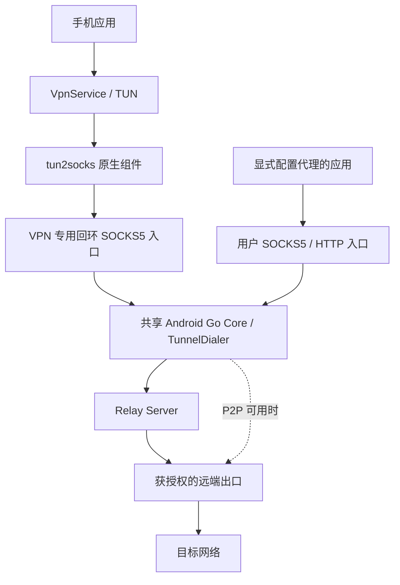

# Android 客户端代理实施规划

日期：2026-10-03。状态：代码与双 ABI 构建已完成，剩余工作为 Android 真机验收。

**目标与范围**

用户已确认同时需要 Android VPN 代理和本机 SOCKS5 / HTTP 代理。本次在已有 Android 网络出口能力上增加客户端能力，复用 RelayProxy 身份、审批、TCP/UDP 隧道和出口授权模型。

首个完整版本应支持：

- VPN 接管手机应用的 TCP、UDP、DNS；提供全部应用、仅选中应用、排除选中应用三种范围。
- 本机 SOCKS5 CONNECT、UDP ASSOCIATE，以及 HTTP 正向代理和 HTTPS CONNECT。
- VPN、本机代理、网络共享三个独立开关，允许组合运行；一个安装身份、一个 Go Core、一个 Relay 控制会话。
- 选择远端出口，显示待审批、客户端未授权、出口不可用、正在重连等实际状态。
- QUIC 优先、TLS/yamux 回退；完整版本支持已授权的 P2P 直连及 Relay 回退。
- 保持 Android 8.0 / API 26 起的现有最低版本和 arm64-v8a、armeabi-v7a 构建目标。

默认采用全局 PROXY，显式指定一个出口；仅有一个可用出口时允许自动选中。多个出口时要求选择，不把“自动”解释为任意负载均衡。已选出口离线时重连或报错，不悄悄切到另一个出口。

首版暂不包含按应用选择不同出口、复杂域名分流、Fake-IP、热点流量接管、HTTPS 解密、远端 ICMP 转发、Always-on / 系统级断网保护。后续可在统一拨号接口上扩展路由规则。现有出口模式保持可用；旧配置迁移后不会自动开启 VPN 或本机代理。

**当前实施状态**

- M0 构建验证：固定 `hev-socks5-tunnel 2.18.0` 源码归档及 SHA-256；使用 NDK 27.2.12479018、API 26 构建 `arm64-v8a` 和 `armeabi-v7a`。gomobile 与 Hev ELF 均以 16 KB LOAD 对齐链接，Gradle 在打包前逐个检查全部原生库。
- M1 代码：Android Go Core 按设置申请 `proxy.client` / `proxy.exit`，提供回环 SOCKS5 CONNECT、UDP ASSOCIATE、HTTP/HTTPS CONNECT；Server 按设备授权范围下发在线出口清单，Android 可选出口或手动填写 ID。
- M2 代码：新增 `RelayVpnService`、系统 VPN 授权、TUN fd 生命周期与 Hev TUN 引擎。VPN 为 IPv4/IPv6 配置默认路由、MTU 1280，并排除 RelayProxy 自身应用。VPN 专用 SOCKS5 入口与用户 SOCKS5/HTTP 由同一个 `RelayExitService` Core 提供；切换时重建 Core 以刷新客户端授权和监听端口。
- M3 代码：完成全部应用、仅选中应用、排除选中应用三种 VPN 范围，配置 DNS 经 TUN 转发；同步 Android VPN 底层网络；Android 代理客户端接入现有 P2P QUIC 与 Relay 回退；VPN、网络出口、本机代理独立启停；首页展示实际路径、代理字节数和 TUN 统计。
- M4 构建：配置版本升级到 `0.2.0`，Debug/Release、两个 ABI 与 16 KB ELF 对齐由同一构建入口检查。稳定性、性能、功耗、安装升级与厂商兼容性仍属于真机验收，不以构建结果替代。
- 已通过 `go build ./...` 及 arm64/arm32 的 Debug、Release APK 构建；Release lint、APK v2/v3 签名校验和三项原生库 16 KB ELF 对齐检查通过，构建明确跳过测试。尚未在 Android 真机或模拟器验证转发、系统 DNS、IPv6-only/DNS64、网络切换和生命周期矩阵，APK 构建成功不代表这些场景已验收。
- Server 清单只展示在线且对当前设备授权的出口。代码侧剩余边界是首版明确排除的高级分流、热点、Always-on 等功能；尚未完成的交付项均为真机/系统行为验证与测量。

**实施前基线与已补齐缺口**

| 位置 | 实施前已有能力 | 本次已补齐内容 |
| --- | --- | --- |
| [Android 说明](../android/README.md) | 网络出口、P2P、省电与网络切换 | 增加 Android VPN 和本机代理入口、配置及状态说明 |
| [mobile/androidcore/client.go](../mobile/androidcore/client.go) | 设备认证、出口 Handler、心跳、重连、P2P Exit | 增加客户端授权、拨号器、代理监听器、出口列表及客户端 P2P |
| [agent/client/dialer.go](../agent/client/dialer.go) | TCP/UDP 代理拨号、P2P 优先及 Relay 回退 | 接入 Android 已完成认证的会话 |
| [internal/proxy/socks5/server.go](../internal/proxy/socks5/server.go) | SOCKS5 CONNECT，保留域名传给出口 | 增加 UDP ASSOCIATE |
| [internal/proxy/httpproxy/server.go](../internal/proxy/httpproxy/server.go) | HTTP 和 CONNECT | 接入移动端生命周期及配置 |
| [agent/app/agent.go](../agent/app/agent.go) | 桌面端代理、出口、P2P 的组合方式 | 可参考接线方式，不直接将整个桌面 Agent 搬进移动端 |
| [NetworkBinder.kt](../android/app/src/main/kotlin/com/relayproxy/android/NetworkBinder.kt) | Wi-Fi / 蜂窝选择和进程网络绑定 | 同步 VPN 底层网络并在切换时重建 Core |
| [device_auth.go](../internal/protocol/device_auth.go)、[message.go](../internal/protocol/message.go) | 批准结果、心跳、RDP 清单下发 | 增加代理出口清单字段 |
| [server/gateway/router.go](../server/gateway/router.go) | 出口解析及授权，唯一出口自动选择 | 按相同授权范围下发客户端清单 |

图索引已按所用源码路径检查；主体路径无记录的覆盖缺口。`server/api/router.go` 曾出现 freshness 变化，相关 `/api/v1/exits` 路由和处理函数已直接读取源文件核对；该接口是管理认证接口，不作为移动端设备发现接口。资源目录中未索引的图片不影响本规划。现状结论来自源码检查，尚未以 Android 真机验证。

**推荐架构**

已固定并集成 `hev-socks5-tunnel 2.18.0`：使用其 Android 构建、TUN fd 接口和 TCP/UDP 双栈支持。配置采用标准 SOCKS5 UDP 模式，关闭专有 UDP-over-TCP、握手流水线和 Fake-IP；Relay 的 UDP stream/datagram 由 Go Core 自己协商。[上游文档](https://github.com/heiher/hev-socks5-tunnel)

该方案已将 SOCKS5 UDP 能力同时用于 VPN，TUN 数据留在原生层，Go 数据留在 Go 层，Kotlin 负责控制和状态。代价是增加一个原生依赖和一次本机回环转发；吞吐、耗电和长时稳定性仍需真机测量。

未采用的备选是 gVisor netstack 直接适配 `TunnelDialer`。它可减少本机 SOCKS 层，但需要承担 TUN 接入和协议栈适配；gVisor 官方也说明 netstack API 没有稳定性保证。[gVisor 说明](https://gvisor.dev/docs/architecture_guide/networking/)

这属于 Android 专用入口，不恢复桌面旧 `agent/tun` 或修改桌面 `network.mode` 语义。

**运行时与生命周期**

- `RelayExitService` 作为进程内唯一共享运行时，串行处理启动、停止、配置变更和网络事件；Go Core 只由该服务创建和销毁。
- 共享前台服务负责网络共享、显式代理及 VPN 所需 Core；`RelayVpnService` 只负责系统 VPN 授权、TUN、原生引擎和撤销事件，两者不会各自建立 Relay 会话。
- 明确区分用户期望的功能开关、服务器批准能力和实际运行状态；任一功能仍在使用时，不能因另一功能停止而销毁共享核心。
- VPN 需要回环 SOCKS 入口；未开放用户 SOCKS5 时自动使用独立内部端口，供原生引擎使用。关闭用户 SOCKS5 开关不能关闭 VPN 所需入口。
- VPN 首次启动：检查配置 → `VpnService.prepare()` → 启动共享 Core → 确认 `proxy.client` 与出口 → 建立 TUN → 启动原生引擎。普通启动在准备完成前不接管手机流量。
- 从“仅代理/仅出口”切到 VPN 时，需要重建之前未保护的网络 socket，再建立 TUN；预期已有流量可能重连，界面明确显示切换中。
- 运行中 Relay 断线：TUN 保留，被接管流量失败或等待重连，不自动改走本机直连。用户主动停止、VPN 权限撤销或进程死亡时，系统可能恢复原网络；首版不承诺跨进程死亡的 kill switch。
- 停止 VPN：停止接收新流、终止原生引擎并等待退出、关闭 VPN 专用入口、释放 TUN fd；共享运行时仍按其他功能的需求存活。错误回滚和重复停止必须幂等。
- Kotlin 在原生引擎运行期间持有 `ParcelFileDescriptor`；Hev 直接使用传入的外部 fd 且不接管其所有权。停止时先等待原生线程退出，再关闭 Kotlin 持有的描述符，避免提前关闭或复用旧编号。

Android 每个用户/工作资料只能运行一个 VPN，`prepare()`、`onRevoke()`、前台通知和 TUN 关闭都需要完整处理。应用范围使用系统允许列表或排除列表，两者互斥，修改时重建 TUN。[Android VPN 指南](https://developer.android.com/develop/connectivity/vpn)

**网络绑定与防止隧道回环**

VPN 建立时排除 RelayProxy 自身包名，使 Relay TCP/TLS、QUIC UDP、P2P 打洞/直连和出口连接不被 TUN 再次接管。`NetworkBinder` 将进程绑定到选定的物理 `Network`；切换 Wi-Fi / 蜂窝时更新 `setUnderlyingNetworks()`，并重建共享 Core 以刷新 Relay、P2P 和 UDP association。`setUnderlyingNetworks()` 本身不移动已有连接。[VpnService API](https://developer.android.com/reference/android/net/VpnService)

网络观察过滤 VPN 网络，避免把自己的 VPN 当成上游。本机代理监听器和 tun2socks 的回环连接不离开设备。[Network API](https://developer.android.com/reference/android/net/Network)

共享 Core 启动前先把进程绑定到选定的物理 `Network`，Relay 域名解析和新建连接随该网络发出，避免重连等待自己的 VPN 隧道。切换底层网络时重建 Core；数据包不经 JNI 逐个往返。

**协议、授权与出口选择**

- 按启用功能申请 `proxy.client`、`proxy.exit` 或两者。已有只获准出口能力的设备必须能显示“客户端待授权”，不能因设备整体 approved 就开放代理。
- 拨号器只能读取完成身份认证且具备客户端能力的 ready session，不能直接暴露 `manager.Session()` 的未认证连接。
- 分离入站 P2P 控制消息与 Exit 数据流接收。客户端单独运行也要处理服务端 P2P 控制；只有获批且启用共享时才接收出口 TCP/UDP 请求。
- 在 `DeviceAccepted` 和 `PongMessage` 增加可选 `proxyExits` 清单，内容只包含 ID、名称和可用状态；使用存在性区分旧服务端不支持与明确的空清单。
- 服务端按当前设备身份、所有者及既有网关授权规则过滤清单；不能把管理 API 的全量列表直接下发。支持服务器本地出口的特殊 ID；手机自身默认不出现在可选远端出口中。
- 清单只服务于 UI 和选择，每次开流仍由 Server/Exit 校验授权；P2P 继续受现有租约和 ACL 约束。
- 旧服务端不支持清单时，支持手工指定出口 ID，以及沿用服务端“唯一可用出口”的行为；多个出口且未指定时显示明确错误。旧客户端应能忽略新增可选字段，以兼容测试确认，不预先强制升级协议版本。
- 手工切换出口只影响新连接；已有连接结束或由用户重连，不承诺跨出口迁移会话。出口授权撤销应关闭相关现有资源并停止新流。

**SOCKS5 UDP 与 DNS**

UDP ASSOCIATE 需要实现完整生命周期：TCP 控制连接、回环 UDP socket、来源校验、IPv4/IPv6/域名地址编解码、按目标维护有界 association、空闲回收，以及 TCP 控制连接断开时释放全部 UDP 资源。UDP 转发统一调用 `DialUDP`；不支持的 SOCKS 分片明确丢弃，不能误当普通载荷。[RFC 1928](https://www.rfc-editor.org/rfc/rfc1928.html)

用户端口默认 `127.0.0.1:1080` 和 `127.0.0.1:8080`，可修改端口但首版仅允许回环监听；IPv6 回环如启用须单独绑定。端口冲突要失败回滚并展示原因。回环端口仍可能被同机其他应用使用，不把它描述为单应用私有授权边界。

VPN 设置明确的 DNS 上游地址，DNS UDP/TCP 查询经选定出口转发；不回退到本机物理网络 DNS。SOCKS5 域名请求保留域名给出口；已经由调用应用自行解析成 IP 的显式代理请求无法逆转其前置 DNS 行为。

首版默认全局代理，因此无需依赖 Fake-IP 推导域名。应用自行使用的 DoH/DoT 作为普通 TCP/UDP 流量通过 VPN。测试必须覆盖系统 Private DNS、IPv6-only / DNS64 网络与 IPv6 上游；不能仅凭设置 `addDnsServer()` 就宣称所有 DNS 场景已通过。

优先交付 IPv4/IPv6 双栈。若验证阶段暂时只支持 IPv4，必须阻断未支持的 IPv6 并明确显示限制，不能通过 `allowFamily(AF_INET6)` 让其从底层网络绕过 VPN。MTU 从保守值开始实测，覆盖大包、UDP 分片/重组和 ICMP 错误行为，不以普通网页能打开代替验证。[VpnService.Builder API](https://developer.android.com/reference/android/net/VpnService.Builder)

**界面和配置**

首页增加“代理上网”区域：选中出口、VPN 开关、本地代理开关、连接状态、实际传输路径和上下行计数。原“网络共享”保持独立入口。设置中配置本地端口、VPN 应用范围、DNS 和首选上游网络；首次使用优先完成服务端连接、客户端审批和出口选择。

配置新增版本字段与 `clientEnabled`、`exitEnabled`、`vpnEnabled`、`socksEnabled`、`httpEnabled`、端口、`selectedExitId`、`vpnAppMode`、`vpnPackages`、DNS 等字段。旧 `desiredRunning` 只迁移为原网络共享意图。权限未获准、已选应用卸载、包名不可见及空白允许列表都要有明确行为，空白允许列表不能意外变成全部应用。

保持 `StatusJSON` 兼容，并增加各功能实际状态、已批准能力、可用出口、监听地址、VPN 状态、错误码、计数和网络代次。UI 使用聚合状态刷新，不按包更新。不同入口共享统计口径，VPN TUN 字节与隧道字节分别标注，避免重复计数。

前台服务类型按实际模式处理：现有共享服务使用的 `specialUse` 需更新用途说明；VPN 服务验证符合 `systemExempted` 的条件后使用对应声明和权限，不能把未获准 VPN 的普通代理服务直接视为系统豁免。Always-on 首版显式标记不支持；测试新系统上的启动、通知及后台限制。[Android 前台服务类型](https://developer.android.com/develop/background-work/services/fgs/service-types)

**实施顺序与里程碑**

| 阶段 | 具体工作 | 完成标准 |
| --- | --- | --- |
| M0 技术验证 | 固定 tun2socks 版本；核对依赖与 fd 契约；验证双 ABI、当前 NDK、16 KB 页设备兼容；用独立标准 SOCKS5 测试端点验证 VPN、自身应用排除和底层网络绑定 | 两个 ABI 能构建；真机 TCP/UDP 通过；启停不泄漏 fd；确认主方案及测量基线 |
| M1 本地代理闭环 | 扩展移动核心角色、ready session、出口清单；接 SOCKS5/HTTP；实现 UDP ASSOCIATE；提供最小选择及状态 UI | VPN 未开启时，HTTP/HTTPS、SOCKS5 TCP/UDP 均经指定出口；审批/拒绝/端口冲突正确 |
| M2 VPN 闭环 | 共享运行时、VpnService、原生 TUN 引擎、专用 SOCKS 入口、自身应用排除和物理网络绑定；先用 Relay 验证 | 手机应用 TCP/UDP/DNS 走远端；双栈策略明确；本地代理与 VPN 可同时启停；代理失败不转 DIRECT |
| M3 产品完整性 | 应用范围、配置迁移、路径与流量状态、P2P Client、网络切换、省电策略和共享并行 | 代码完成；真机网络切换、P2P 与原出口回归待验收 |
| M4 稳定与交付 | 长时运行、并发和异常测试；两个 ABI APK；安装升级；Android 文档及发布说明 | 双 ABI 可重复构建；其余验收、测量和安装升级待真机执行 |

顺序为 M0 → M1 → M2 → M3 → M4。M1 是首个可独立使用的交付点；完整需求以 M4 为完成点，不能把本地端口可用当作 Android VPN 已完成。

16 KB 页兼容检查覆盖 gomobile AAR 和新增原生库的 ELF 对齐、APK 打包及设备运行，不能只检查新依赖。检查方法参照 [Android 页大小兼容文档](https://developer.android.com/guide/practices/page-sizes)。

**预计改动位置**

| 位置 | 责任 |
| --- | --- |
| `mobile/androidcore/client.go`，新增同包 runtime/proxy/status 文件 | 角色、认证就绪、统一拨号、代理监听器、状态和生命周期 |
| `internal/proxy/socks5/` | UDP ASSOCIATE 与协议、资源、并发测试 |
| `internal/protocol/`、`server/gateway/`、`server/session/` | 代理出口清单、授权过滤与兼容处理 |
| `android/.../RelayVpnService.kt`、Hev JNI 包装 | 系统 VPN、TUN/原生资源管理 |
| `android/.../NetworkBinder.kt`、`RelayExitService.kt` | 单核心协调、网络事件、服务需求和省电状态协调 |
| `android/.../ConfigStore.kt`、`MainActivity.kt`、`SettingsActivity.kt` | 配置迁移、功能开关、应用选择和错误展示 |
| `android/app/src/main/AndroidManifest.xml`、Gradle、`scripts/build-android*` | 服务/权限、新原生依赖、双 ABI 打包和 native 库校验 |
| `android/README.md` | 客户端使用、审批、出口选择、限制与排错 |

实现复用了 Android 进程物理网络绑定，并通过 VPN 应用范围排除自身包；没有侵入公共隧道和 P2P socket 创建路径。工作区原有 RDP/P2P 改动未被本次 Android 实现覆盖。

**验收矩阵**

| 范围 | 必测场景 | 预期 |
| --- | --- | --- |
| 审批 | pending、只有 exit 授权、只有 client 授权、撤销、无出口、多出口 | 能力分别受控；错误可见；无未认证代理流量 |
| 本地入口 | HTTP、CONNECT、SOCKS 域名/IPv4/IPv6、UDP 多目标、TCP 控制关闭、端口占用 | 目标/回包正确；无 UDP 越界转发；停止后资源回收 |
| VPN | 浏览器、下载、UDP echo、支持时 HTTP/3、系统 DNS、DoH/DoT、Private DNS | 流量按指定出口到达，DNS 策略符合预期 |
| 双栈 | IPv4-only、双栈、IPv6-only/DNS64、大 UDP、低 MTU | 已支持路径可用；未支持族不绕行 |
| 传输 | QUIC、TLS/yamux、UDP datagram/stream、P2P 成功/失败 | 明确展示实际路径；新连接回退；不承诺所有存量连接无损迁移 |
| 生命周期 | 拒绝 VPN 授权、系统撤销、连续开关、切换应用范围、进程结束/重启 | 无残留监听器或重复核心；状态一致；按已声明边界恢复网络 |
| 网络与电源 | Wi-Fi→蜂窝→Wi-Fi、飞行模式、弱网、Relay 重启、息屏/Doze | 无回环；恢复后新流可用；无空闲忙循环 |
| 共存 | VPN+本地代理、VPN+Exit、三者同时、与其他 VPN 切换 | 三种功能独立启停；Exit 对外 socket 不被再次代理 |
| 稳定性 | 至少 100 次启停、8 小时混合负载、并发 TCP/UDP | 无 fd/线程/goroutine 持续增长或崩溃；记录 RSS、CPU、耗电、吞吐和 RTT |
| 交付 | arm64/arm32、最低 API 边界、近期系统、至少两种厂商真机 | 构建、安装、旧配置升级通过；16 KB 页设备有实际验证记录 |

Go 验证先覆盖改动包及协议集成测试，再运行 `go test ./... -count=1` 和 `go vet ./...`；并发资源管理执行适用的 race 检查。Android 需构建检查、仪器测试与真机端到端抓包验证。吞吐和功耗目标在 M0 固定设备/网络后设定，当前不虚构性能指标或完成日期。

**进入实施前的技术结论要求**

M0 已留下选定依赖的固定版本、双 ABI/页大小构建结果及 fd 契约；自身应用排除、底层网络绑定、TCP/UDP 转发和资源释放仍需留下真机验证记录。不能以构建通过替代 arm32、UDP 或 VPN 与本地代理同时运行的真机验收。

以上状态记录了首轮实现的范围和验证边界。真机端到端验收仍是完成 VPN 代理交付的必要工作。后续如需提交，提交信息使用 `<type>(<scope>): <中文说明>`，例如 `feat(android): 增加本地代理与客户端授权状态`，描述必须与实际改动一致。
