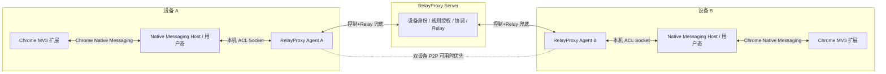
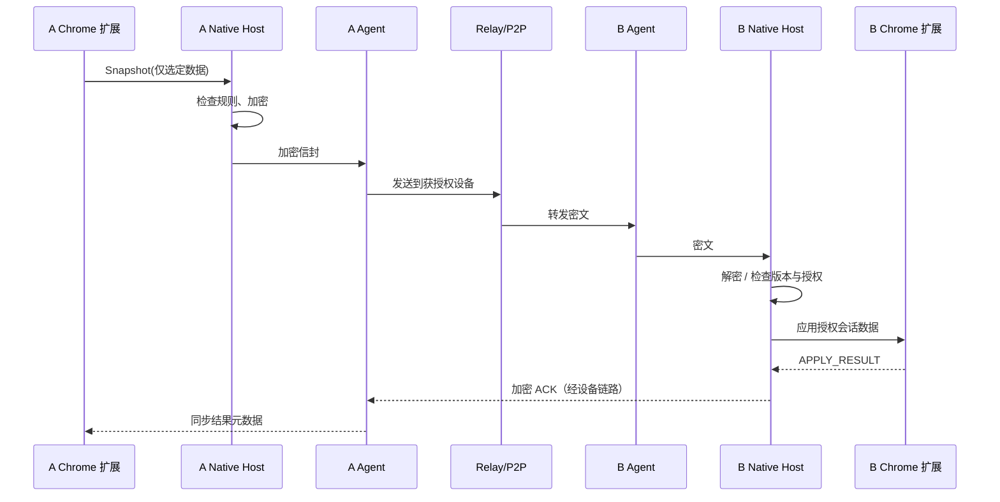

# RelayProxy Browser Session Sync — 设计与开发方案

> 版本：v1.0（设计草案）  
> 日期：2026-10-10  
> 目标仓库：`timwai/RelayProxy`  
> 建议开发分支：`feat/browser-session-sync`（尚未创建）  
> 目标平台：Windows / macOS 桌面版 Chrome  
> 首期同步模式：设备 A → 设备 B，单向、指定网站、自动 + 手动同步

## 0. 执行摘要与技术决策

**目标**：同一用户控制的两台已授权设备中，A 的 Chrome 登录某个指定网站后，B 的 Chrome 在会话可迁移且同步已完成的前提下，打开该网站时无需重复登录。

**技术路线**：Chrome MV3 扩展 + 本机 Native Messaging Host + RelayProxy Agent 会话同步模块 + 现有 Relay Server 身份/设备授权与数据隧道。优先复用可用于设备对设备通信的 P2P 传输，失败时回退 Relay。禁止复用现有无令牌的公开消息推送 URL 传递会话凭据。

**安全基线**：域名和 Chrome Profile 显式授权、发送方与接收方双向确认、端到端加密、仅元数据审计、无明文服务器存储、可随时暂停与撤销。只有用户本人或明确授权的账号/网站允许同步。

**关键约束**：Cookie 并不等于所有网站的登录状态；某些站点使用 LocalStorage、SessionStorage、短时 Token、设备绑定会话、Passkey、硬件密钥或风控策略。对 DBSC 等设备绑定机制，**不提供绕过**，UI 显示“不支持跨设备迁移 / 需在 B 独立登录”。

### 技术决策表

| 项目 | 首期决定 | 理由 |
|---|---|---|
| 同步方向 | 单向 A → B | 消除双端写入冲突、避免刷新令牌竞争 |
| 同步内容 | 指定 Cookie 名称清单，LocalStorage 可选白名单 | 最小权限；不导出整个浏览器用户数据 |
| 接入浏览器 | Chrome Extension Manifest V3 | Chrome 官方支持的扩展架构 |
| 桥接 | Native Messaging + 用户态进程 | 无需直接读写 Chrome SQLite；兼容 Windows/macOS |
| 加密 | 独立端到端 HPKE 或审计过的同等实现 | Relay Server 与 Agent 网络层不必接触明文 |
| 初期传输 | Relay 稳定路径为基础，P2P 可选优化 | 当前代理 P2P 主要面向 Client ↔ Exit，不能假定已是通用设备消息通道 |
| 离线 | 初期默认不在服务器缓存凭据 | 降低云端凭据暴露面；后续可选密文短期缓存 |
| 配置分发 | GUI 配对 + 双端确认 | 同身份设备也不默认互相信任敏感凭据 |
| 登录验证 | 站点适配探测 + 用户确认 | 通用扩展无法可靠判断所有网站的登录态 |

## 1. RelayProxy 现状与复用范围

2026-10-10 对 `main` 分支公开仓库文件的核对：

- `README.md`：已有 Relay Server / Relay Agent、设备身份、审批与授权、SOCKS5/HTTP、规则分流、远程桌面、监控及消息通知；Agent 为 Go，桌面 GUI 为 Wails + React。
- `docs/proxy-p2p-direct-path-design.md`：P2P 代理直连路径设计强调“保持 Relay 回退”；文档状态为 Implementation in progress。实现本功能时必须先验证当前通用设备间传输接口的实际可复用程度。
- `agent/gui/frontend/src/App.jsx`：现有 GUI 的 `NAV` 导航分为概览、连接、本机、观察；适合在“本机”下新增浏览器同步页面。
- `agent/gui/frontend/src/bridge.js`：已有 Wails/React 桥接入口 `call`、`callJSON`、`saveConfig`；新增页面沿用已有调用与版本修订模式。
- `agent/gui/frontend/package.json`：React 18 + Vite 5；`go.mod`：Go 项目并已有 QUIC/TLS/加密相关依赖。

**可以复用**：Agent 设备身份与连接、Server 设备发现/授权、Relay 隧道、已稳定的 P2P 组件、GUI 构建与测试脚本、日志/状态展示。  
**不能直接复用**：HTTP/SOCKS 网络代理不能传递 Chrome Cookie；通用传输设备间敏感会话数据的能力须独立设计 ACL 和端到端加密，不把代理出口权限等同于浏览器登录授权。

## 2. 需求与范围

### 2.1 用户故事

1. 用户在 A、B 的 Chrome 安装 RelayProxy 浏览器扩展，并在两台电脑安装/运行 RelayProxy Agent。
2. 两端设备已在 Relay Server 上审批，使用独立设备身份识别。
3. 用户在 GUI 中配置 `https://example.com`，选择 A 为来源、B 为接收者；两端分别确认网站和 Chrome Profile。
4. A 首次在网站完成正常登录，扩展检测所选会话 Cookie 的变化，向 B 发送加密会话快照。
5. B 扩展在后台接收并应用数据；用户随后打开 `https://example.com`，对支持迁移的网站应维持登录状态。
6. A 的选定会话发生变化、过期或退出时，B 可收到更新/失效标记；删除规则时双方停止传输并清除受该规则管理的本地缓存。

### 2.2 首期范围（MVP）

- Windows x64、Windows ARM64、macOS Intel/Apple Silicon 上运行的桌面 Chrome（按实际测试矩阵发版）。
- 相同或经特别授权的 RelayProxy 设备；每个站点和每个接收设备独立授权。
- 仅 HTTPS 网站；精确 Host 默认，不自动包括子域名。
- 默认同步明确勾选的 Cookie 名称；可单独开启指定 LocalStorage Key（需要兼容性测试）。
- 用户态 Native Messaging Host、自动增量同步、强制同步、状态/错误提示、暂停、撤销。
- Chrome 默认普通浏览 Profile；Incognito、Android Chrome 暂不支持。

### 2.3 非目标

- 不同步整个 Chrome Profile、密码管理器、书签、浏览历史、IndexedDB 全量数据或任意网址的敏感 Token。
- 不模拟或绕过网站的 MFA、Passkey、安全挑战、设备绑定会话与管理员安全策略。
- 不向不同个人/组织非法共享付费账号或网站授权。
- 不保证所有网站做到“B 首次导航的第一个 HTTP 请求一定已登录”，只在成功预应用时达成。

## 3. 系统架构



**数据分层**：

- Chrome 扩展：只处理被授权站点的数据采集、Cookie 写入、授权交互。
- Native Host：属于当前登录操作系统用户，作为 Chrome 与 Agent 的可信本地边界；校验扩展 ID、浏览器 Profile 绑定；完成加解密和本地敏感数据保护。建议单独可执行文件 `relay-browser-native-host`，不在 SYSTEM 服务中直接操作 Chrome 用户目录。
- Agent：管理规则状态、消息顺序、重连和流量传输，只转发加密载荷；运行在服务模式时，本地 Socket 必须绑定 OS 用户与 ACL。
- Relay Server：核验独立的 `browser.session.send` / `browser.session.receive` 权限，确认双方配对、转发消息；初期无明文或密文会话持久化。
- P2P：只有在已实现且通过回归测试的设备到设备抽象上启用，不能简单复用只面向网络出口的代理 P2P 数据流。

## 4. 浏览器扩展设计

### 4.1 Manifest V3 权限

建议静态权限按需配置：`cookies`、`nativeMessaging`、`storage`、`alarms`；必要时增加 `scripting`、`tabs` / `webNavigation`。站点权限使用 `optional_host_permissions` 并在添加规则时由用户确认，不声明全站永久权限。Manifest V3 background 使用 service worker，异步事件处理支持休眠重启。

权限必须与实际功能一致；所有 DOM 注入、LocalStorage 访问仅在授权的 Origin 范围内。不得向网页暴露 Native Host 的控制消息接口。

### 4.2 采集策略

- Cookie：使用 `chrome.cookies.getAll` 枚举该站点、`chrome.cookies.onChanged` 侦测变化；保存字段包括 `name`、`value`、`domain`、`path`、`secure`、`httpOnly`、`sameSite`、`expirationDate`、`hostOnly`、可用时的 `partitionKey`。不要复制源设备的 `storeId`；接收端将其映射到用户已选择的 Chrome Profile/Cookie Store。
- 过滤：默认按明确 Cookie 名称白名单；引导用户从候选列表中勾选，不在 GUI 显示值。域名、Path、分区和顶层站点必须保持约束，不能把主域 Cookie 意外扩散到所有子域。
- LocalStorage：**可选**。内容脚本读取由用户勾选的 Key；仅存储必要的认证数据。普通 `storage` 事件不会可靠覆盖同一文档自身写入，需在页面活动、登录后、页面重新可见等时机差量核对。
- SessionStorage、IndexedDB：首期不支持；设计适配器扩展点，不依赖在任意时间完全观察其变化。
- `HttpOnly` Cookie：由 `chrome.cookies` API 处理，不通过网页 JavaScript 读取。

### 4.3 接收侧应用

1. 先校验消息顺序、规则版本、来源设备、目标浏览器用户/Profile 和授权范围。
2. 解密载荷，检查 Origin、域名、Cookie 元数据和有效期。
3. 对受此规则管理的 Cookie 使用 `chrome.cookies.set`；`hostOnly` Cookie 不应附加 Domain，`Secure` 必须对应 HTTPS；按 Chrome API 要求处理 `partitionKey`。
4. 记录处理结果 `APPLIED`，但不直接宣称网站已认证；可按网站适配器回报 `LOGIN_VERIFIED`。
5. 为避免竞态，通常通过后台预应用；扩展提供“同步后打开网站”按钮，强制等应用 ACK 后打开。用户手动输入 URL 时只能尽力在导航前已有更新，不能保证拦截首个请求。

### 4.4 服务工作线程生命周期

通过 `chrome.runtime.onStartup`、`cookies.onChanged`、`alarms` 和 Native Messaging 事件唤醒并重连；自动同步与 Native Host 断开后重试。避免依赖常驻的浏览器 JS 定时器。规则、序号和已管理的 Cookie 元数据可保存到扩展自身受保护存储，但**不把明文 Cookie/Token 保存在 `chrome.storage.sync`**。

## 5. Agent 与 Native Messaging Host

### 5.1 Native Host

拟新增命令行：`relay-browser-native-host --native-messaging`。Chrome 按其 Native Messaging 协议启动独立进程：每条消息是原生字节序的 32 位长度前缀 + UTF-8 JSON。来自 Host → Chrome 的单条消息上限为 1 MiB；内部再设置保守的 256 KiB～512 KiB 应用包大小并拒绝异常大包。

安装时将扩展固定 ID 加入 Native Messaging Host `allowed_origins`。Windows 在 Chrome NativeMessagingHosts 对应注册表位置写入 manifest 路径；macOS 在当前用户 Chrome NativeMessagingHosts 目录安装 manifest。具体目录与注册表根须按 Chrome 官方文档及浏览器渠道实现。**扩展 ID 必须稳定、不可使用通配**。

本地通信：Native Host 通过用户专用命名管道（Windows）或 Unix domain socket（macOS）连接 Agent；服务端校验当前用户 SID/UID，不在局域网暴露 HTTP 端口；避免本机其他用户串读会话。必须考虑 RelayProxy Agent 被安装为 SYSTEM 服务的情形。

### 5.2 Agent Session Manager

职责：同步规则生命周期、设备对等鉴权、规则 ID 与授权策略校验、版本/序号去重、重连补偿、Relay/P2P 选择、ACK/ERROR 上报、限速和审计元数据。独立于代理路由引擎与 RDP，不影响 SOCKS5/HTTP 逻辑。

建议可识别能力：`browser_session_sync_v1`；权限与 `proxy.use`、`rdp.connect` 完全隔离。

## 6. Server、授权与密钥模型

### 6.1 新增权限

- `browser.session.send`：指定来源设备可以向获授权的接收设备同步指定 Rule。
- `browser.session.receive`：接收设备接受来自指定来源的规则。
- 规则需具备：来源 Device ID、接收 Device ID、规则 ID、双方明确确认状态、可选网站哈希/策略摘要、过期时间。
- **同身份也不能默认获得会话同步权限**；不同身份需 Relay Server 跨身份授权 + 双端确认。管理员可撤销。

### 6.2 双端密钥确认

每个 OS 用户 + Chrome Profile + RelayProxy 设备组合生成独立会话同步密钥对，不复用 RelayProxy 安装私钥作跨用途解密。推荐使用审计成熟的 HPKE（RFC 9180，X25519/HKDF-SHA256/AEAD）实现；将公开密钥与 RelayProxy 设备身份绑定，并在 A、B 首次配对时使用二维码或短校验码手动核对指纹，以避免服务器替换公钥。

Native Host 加密会话净载荷，Agent/Server 仅处理密文；B 的 Native Host 才能解密。私钥应存于 Windows DPAPI/密钥保护设施或 macOS Keychain，并绑定当前 OS 用户；不进入配置 YAML、Git 日志、Server SQLite 或浏览器同步云端。消息认证、AAD 必须覆盖协议版本、Rule ID、双端设备 ID、版本和到期时间。使用规范化加密库避免自行设计密码学协议。

### 6.3 注销与撤销语义

- 暂停规则：立即禁止进一步更新，但不一定登出接收端网站。
- 撤销同步：停止消息流，尽最大努力通知 B 清除该规则管理的本地副本；如果 B 离线，下一次上线应执行撤销。
- **撤销 RelayProxy 授权不等于使网站服务器上的旧会话 Token 失效**。强制所有设备登出须由网站提供的“退出全部设备”能力完成。
- 被管理 Cookie 只删除本规则此前写入且未被本地自主修改的值；避免影响 B 已独立登录的会话。

## 7. 消息协议 v1

建议复用当前 Agent/Server 已认证通道建立 **独立的浏览器同步逻辑流**，不要直接使用公开 `/api/v1/push/{channelId}` 或代理出口数据包语义。

### 7.1 事件类型

| 类型 | 方向 | 说明 |
|---|---|---|
| `RULE_OFFER` | A → B | 配对请求、Origin 与范围摘要（通过端到端保护） |
| `RULE_ACCEPT` / `RULE_REJECT` | B → A | 接收者明确授权 / 拒绝 |
| `SYNC_REQUEST` | B → A | 请求最新快照，需双方授权仍有效 |
| `SESSION_SNAPSHOT` | A → B | 完整受管理 Cookie/Storage 快照 |
| `SESSION_DELTA` | A → B | 变化集合 |
| `SESSION_TOMBSTONE` | A → B | 明确注销 / 失效的受管理数据 |
| `SYNC_ACK` | B → A | `RECEIVED`、`APPLIED`、`FAILED` |
| `RULE_REVOKE` | 任一端 / Server | 停止共享、清理本地副本 |
| `SYNC_ERROR` | 任一端 | 兼容性、拒绝、版本和应用错误 |

### 7.2 外层消息字段（示例，仅表示结构）

```json
{
  "protocol": "browser.session.v1",
  "type": "SESSION_SNAPSHOT",
  "messageId": "uuid-v4",
  "ruleId": "rule_123",
  "sourceDeviceId": "dev_a",
  "targetDeviceId": "dev_b",
  "sequence": 12,
  "createdAt": "2026-10-10T10:00:00Z",
  "expiresAt": "2026-10-10T11:00:00Z",
  "encryption": "HPKE-v1",
  "encapsulatedKey": "<base64>",
  "ciphertext": "<base64>"
}
```

**注意**：Cookie 值、Storage 值和完整 Origin 应位于加密载荷内，避免中继侧访问。外层尽量只暴露路由所需元信息，日志不得记录 `ciphertext` 正文。接收侧检查 `messageId` 幂等、同一规则单调递增 `sequence`，过期与旧版本直接拒绝。Cookie 更新时先删后写可能产生两个 `onChanged` 事件，需要 debounce 合并，避免假注销。

### 7.3 同步时序



### 7.4 更新策略与容量约束

- 默认对同一 Rule 的 Cookie 更新防抖 2 秒；新数据覆盖待发送的旧增量，同步队列只保留最终态。
- 在线时推送增量；重连后先握手交换规则版本与 sequence，再补发**当前最新快照**，避免无界事件重放。
- 每 10～15 分钟允许在浏览器在线且授权未撤销时进行一次轻量状态校对；不为了登录同步持续轮询网站服务器。
- 初期服务器不存储凭据。A 离线且 B 尚未同步时不保证可用；后续可在用户主动开启时支持端到端密文、短 TTL 的服务器离线邮箱。
- 应用层快照建议最大 256 KiB（可配置、受审计的限制）；超限明确失败，不自动上传无限数据或日志。

## 8. 配置与 GUI 设计

### 8.1 服务级开关（拟新增配置，非现有字段）

```yaml
browser_sync:
  enabled: false
  transport: auto           # auto | relay_only
  allow_offline_buffer: false
  max_payload_kib: 256
  reconcile_interval_sec: 900
```

网站/用户/Profile 规则存放在用户态本地安全存储，不应仅以服务级 YAML 全局配置，因为同一电脑可能多个登录用户和多个 Chrome Profile。

### 8.2 规则模型（概念 API）

```json
{
  "id": "rule_123",
  "origin": "https://example.com",
  "includeSubdomains": false,
  "sourceDeviceId": "dev_a",
  "targetDeviceIds": ["dev_b"],
  "sourceProfileRef": "profile_a",
  "targetProfileRef": "profile_b",
  "mode": "one_way_auto",
  "dataTypes": ["cookies"],
  "cookieNames": ["session_id"],
  "localStorageKeys": [],
  "clearManagedOnLogout": true,
  "enabled": true
}
```

`profileRef` 为应用内部局部绑定的随机标识，不是可跨设备复用的 Chrome Profile 绝对目录；接收方独立选择目标 Profile。注意：指定 URL 路径**不能精确隔离**域名级 Cookie，同 Host 的其他路径可能共享 Cookie，界面应明确提示。

### 8.3 Agent GUI

在现有 `agent/gui/frontend/src/App.jsx` 的 `NAV` “本机”分组新增 **浏览器同步** 页面。页面至少包含：扩展安装状态、Native Host/Agent 状态、我的设备、配对及授权、网站规则列表、单向/手动模式、来源/接收设备、Profile、Cookie 名称选择、最近同步时间、传输路径、应用结果、暂停/恢复、撤销、清理缓存、诊断。

添加规则向导：① 输入 HTTPS 网站 → ② 选择来源 Profile → ③ 勾选待同步 Cookie / 选填 Storage Key → ④ 选择 B 设备 → ⑤ B 端明确接受 → ⑥ 指纹校验 → ⑦ 测试同步 → ⑧ 启用自动同步。

UI 状态：`NOT_INSTALLED` / `WAITING_APPROVAL` / `READY` / `SYNCING` / `APPLIED` / `LOGIN_VERIFIED` / `OFFLINE` / `UNSUPPORTED` / `EXPIRED` / `FAILED` / `REVOKED`。不要将 `APPLIED` 混同于 `LOGIN_VERIFIED`。

## 9. 建议新增目录与实现接口

以下均为**待创建的设计路径**，不是声称仓库已存在：

```text
browser/
  chrome-extension/
    manifest.json
    src/background.js
    src/content.js
    src/options.jsx
    src/nativeBridge.js
  native-host/
    main.go
    protocol.go
    pairing.go
    profile.go
    secure_store_windows.go
    secure_store_darwin.go
agent/
  browser_sync/
    manager.go
    transport.go
    rules.go
    status.go
    native_socket.go
server/
  browser_sync/
    authorization.go
    routing.go
    revoke.go
internal/
  browser_sync/
    protocol.go
    envelope.go
    validation.go
agent/gui/frontend/src/
  BrowserSync.jsx
  BrowserSync.test.js
scripts/
  install-browser-native-host.ps1
  install-browser-native-host.sh
docs/
  browser-session-sync-design.md
  browser-session-sync-development.md
```

建议 Go 接口（概念，不是现有签名）：

```go
type BrowserSyncTransport interface {
    Send(ctx context.Context, targetDeviceID string, envelope []byte) error
    Subscribe(ctx context.Context, handler func([]byte) error) error
}

type BrowserSyncPolicy interface {
    Authorize(ctx context.Context, sourceDeviceID, targetDeviceID, ruleID string) error
    Revoke(ctx context.Context, ruleID string) error
}
```

建议 GUI 后端方法按现有 Wails 桥接机制添加：`goBrowserSyncStatus`、`goBrowserSyncListRules`、`goBrowserSyncCreateRule`、`goBrowserSyncApproveRule`、`goBrowserSyncRequestNow`、`goBrowserSyncRevokeRule`。最终命名以已有导出/绑定约定为准，并添加桥接回归测试。

## 10. 开发实施计划

### P0：兼容性验证与安全评审（优先完成，建议 1–2 人日）

- 准备用户有权测试的目标网站，分析其登录态依赖 Cookie、LocalStorage 还是设备绑定机制；确认产品可行性。
- 调查目前 `main` 的 Agent↔Server 数据流及代理 P2P 复用范围，确定可扩展的逻辑流抽象。
- 输出站点兼容性判定：`SUPPORTED_COOKIE_ONLY`、`SUPPORTED_WITH_STORAGE`、`NOT_PORTABLE`、`UNVERIFIED`。
- 完成威胁建模：权限提升、误授权、服务器公钥替换、设备窃取、日志泄露、重放、双用户隔离。

**验收**：至少 1 个自建测试网站可通过受控 Cookie 迁移恢复登录；DBSC/设备绑定网站明确识别为不支持。

### P1：Chrome 扩展 + Native Host（建议 4–6 人日）

- MV3 架构、可选网站权限、Profile 绑定、指定 Cookie 名称筛选、变化监听、防抖。
- Native Messaging 双向通信、Windows/macOS 安装与卸载脚本、扩展 ID 约束。
- 本地用户态授权 Socket、密钥生成与 Keychain/DPAPI 持久化、配对指纹验证。
- B 端 Cookie 设置、错误反馈、扩展启动恢复、手动“同步后打开”。

**验收**：同一台测试电脑可使用模拟传输完成 A→B 加密数据的构造、解密、精确应用；未授权网站及扩展被拒绝。

### P2：Agent/Server 协议与授权（建议 4–6 人日）

- 新增 `browser_session_sync_v1` 协议能力、逻辑流和消息编码。
- Server 配对/规则 ACL，明确发送与接收双端确认；Relay 兜底通信。
- Agent 去重、版本号、防重放、短时断线重试、在线同步与 ACK。
- 权限撤销与清理、设备离线/删除处理、传输大小及频率限制。
- 在 P2P 通道经过可用性验证后启用优选；否则保留 Relay-only。

**验收**：两台实际设备经 Relay 完成端到端同步；撤销设备权限后新消息被阻断；服务器日志/数据库中没有明文凭据。

### P3：GUI 与部署集成（建议 2–4 人日）

- React/Wails 新页面、扩展状态诊断、配对向导、规则编辑、同步日志（不含值）。
- 构建脚本加入扩展产物与 Native Host；Windows/macOS 安装升级流程。
- 配置迁移、安装卸载清理和错误提示；补充 README/使用文档。

**验收**：用户不需要使用命令行即可完成 A/B 配对、授权、规则创建、同步、暂停和撤销。

### P4：回归测试、性能与发布（建议 3–5 人日）

- 不同 Chrome Profile、域名和子域、CHIPS 分区 Cookie、HttpOnly、SameSite、Secure、Session Cookie、到期与登出行为。
- P2P/Relay 切换、离线重连、消息乱序/重复、A/B 网络切断、Host 崩溃、Service 权限差异。
- Windows x64/ARM64、macOS arm64/amd64、Chrome 普通模式；现有网络代理/RDP/GUI 回归。
- 恶意消息与超大包测试、授权绕过测试、敏感数据日志扫描、密钥换绑/旋转演练。

**验收**：安全测试通过，且不会影响现有代理与 RDP 功能；文档列明已验证的网站类型与已知限制。

**粗略工作量**：约 14–23 人日，具体取决于当前 P2P 抽象、GUI 绑定、Native Host 打包与目标网站复杂性。建议 P0 单独设里程碑，不在未经可行性验证时承诺所有网站免登录。

## 11. 测试用例与验收标准

| 编号 | 场景 | 期望 |
|---|---|---|
| T01 | A 正常登录，B 已完成配对，网站支持 Cookie 迁移 | B 接收到应用结果，打开网站维持登录 |
| T02 | A 更新会话 Cookie | B 收到新的单调 sequence，旧值被替换 |
| T03 | A Cookie overwrite 产生删除+新增事件 | 合并成一次有效更新，不误触发登出 |
| T04 | A 主动退出登录 | B 收到失效标记，仅清理受本规则管理的 Cookie |
| T05 | B 独立登录了不同账号 | 不得静默覆盖；提示冲突，必须显式确认 |
| T06 | B 不在线 / A 不在线 | 显示待同步或来源离线，不谎报成功；重连后对账 |
| T07 | P2P 不可用 | Relay 仍可完成同步 |
| T08 | 未获授权设备请求 Cookie | 必须拒绝且不产生数据泄露 |
| T09 | 重放旧 sequence/过期消息 | 拒绝应用，保留新状态 |
| T10 | 任一端撤销配对 | 后续消息拒绝，已管理本地副本按策略清理 |
| T11 | 目标网站使用 DBSC/WebAuthn 绑定 | 明确提示不可迁移，不能绕过 |
| T12 | 多个 Chrome Profile / 多操作系统用户 | 严格隔离，不串号 |
| T13 | 受管理域名以外的网站 | 无采集、无写入、无额外网站权限 |
| T14 | Cookie/Token、明文消息审计 | Server、常规 Agent 日志与诊断输出均不包含明文 |
| T15 | 关闭扩展、Host 崩溃、版本不匹配 | 安全失败，恢复后重新握手 |
| T16 | 目标 Cookie 有 CHIPS partitionKey | 支持时精确映射；不支持时明确拒绝而非写入错误分区 |

建议性能目标（非已验证指标）：两端在线、会话可迁移时，95% 的轻量 Cookie 更新从 A 检测到 B 应用小于 5 秒；不包括网站额外认证、浏览器关闭或离线等待。同步目标必须通过真实设备测试确认。

## 12. 主要风险与规避策略

| 风险 | 应对 |
|---|---|
| 网站设备绑定 / DBSC / Passkey | 只报告不支持，要求 B 正常独立登录；如网站自有 SSO/API 可走官方授权路径 |
| 共享同一刷新令牌引起轮换竞争 | 默认仅 A → B；B 不反向上传；出现冲突暂停并提示 |
| B 已存在其他账号 | 检测 Cookie 冲突并要求明确确认，不静默覆盖 |
| 误把身份授权当凭据授权 | 单独的 `browser.session.*` 能力 + 双端确认 |
| 中继/Server 被攻击 | 本机先加密，手工核对配对指纹，避免密钥替换 |
| OS 多用户 / SYSTEM Service | Native Host 必须当前用户态，Agent 本地 Socket 绑定 ACL |
| 初次直接输入 URL 导航竞态 | 平时预同步；提供“同步后打开”可靠路径 |
| 注销只发生在网页存储内部 | 监听可观测事件 + 定期差量核对；不保证所有存储技术 |
| Cookie 作用域大于 URL 路径 | UI 明示 Host / Path / 分区作用域，精确筛选 |
| 同步违反网站条款或公司政策 | 显式授权、可禁用域名及策略、保留受控审计 |

## 13. 发布策略

- `feat/browser-session-sync` 单独开发，不直接影响 `main`。
- 默认关闭 `browser_sync.enabled=false`；旧 Agent / 扩展未安装时现有功能完全不变。
- API 与事件带版本号，旧 Server 只能拒绝新特性，不影响正常代理/RDP。
- 第一批灰度仅用于自建、可控的登录测试站点；收集兼容性报告，逐步开放通用站点。
- 完成 P0–P4 验收后合并 `main`，在 `README.md` 添加“支持范围与限制”及手册；保持明确的安全告知。

## 14. 文档与官方依据

- RelayProxy 仓库：<https://github.com/timwai/RelayProxy>
- RelayProxy P2P 方案：<https://github.com/timwai/RelayProxy/blob/main/docs/proxy-p2p-direct-path-design.md>
- Chrome Cookies API：<https://developer.chrome.com/docs/extensions/reference/api/cookies>
- Chrome Native Messaging：<https://developer.chrome.com/docs/extensions/develop/concepts/native-messaging>
- Chrome 扩展权限：<https://developer.chrome.com/docs/extensions/develop/concepts/declare-permissions>
- Chrome Storage API：<https://developer.chrome.com/docs/extensions/reference/api/storage>
- Chrome Device Bound Session Credentials：<https://developer.chrome.com/docs/web-platform/device-bound-session-credentials>
- Google 安全团队 2026-04-09 文章：<https://blog.google/security/protecting-cookies-with-device-bound-session-credentials/>

---

**结论**：RelayProxy 最有价值的复用点是已审批设备间的安全连接和跨网络传输，不是 HTTP 代理本身。建议以 P0 目标网站兼容性试验作为第一开发任务，再按“扩展/Native Host → Relay ACL/数据流 → GUI/打包 → 回归”的顺序开发。通过明确双端授权、端到端加密以及兼容性限制，可将它做成独立且可审计的产品功能。