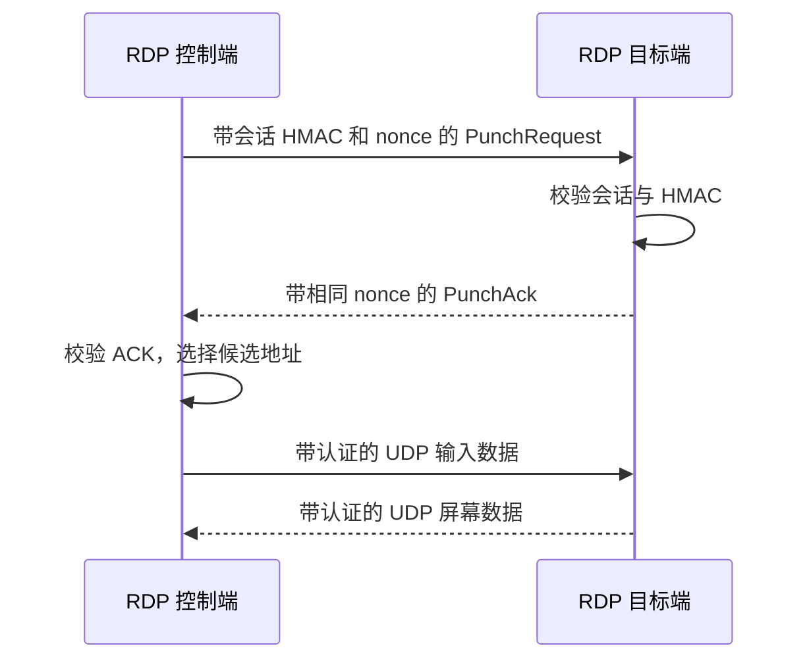

# RDP 网络性能优化设计

日期：2026-10-02。优先目标：缩短远程桌面连接、输入响应和 UDP 恢复等待。

本轮已实现握手修复、单候选快速完成和取消传播。后续阶段列出的探测并行化、路径冷却与真实网络验收尚未实施。

## 1. 定位结果

RDP 的 TCP 与 UDP 独立选择直连或 Relay。`agent/app/agent.go` 中的路径竞速先启动直连，300 ms 后启动 Relay，先成功者获胜；直连立即失败时立即启动 Relay。

最直接的阻塞发生在 UDP 直连建立阶段：

| 环节 | 原行为 | 影响 |
| --- | --- | --- |
| 控制端 `Session.DialUDP` | 调用通用 `punch.Punch`，等待同一地址的 ACK 和对方请求 | RDP 目标端只发送 ACK，合法可达路径仍等待 1.2 s 后失败 |
| 通用 UDP 候选选择 | 首个可用候选之后保留 120 ms 比较窗口 | 仅有一个可用地址时仍增加建立延迟 |
| 候选发布 | 使用 Manager 的上下文，最多等待 5 s | Relay 获胜取消直连后，发布操作仍可能继续等待 |
| Rendezvous 探测 | UDP 读取最长等待 2 s；拨号取消没有立即关闭此 socket | 已经输掉竞速的探测继续占用资源 |

本地端到端测试先复现了约 1.202 s 超时，修复后同一测试约 0.6 ms 完成，并通过小包及分片数据的双向转发。这里是没有 Rendezvous 的 loopback 测试，不能换算为公网 RDP 延迟或帧率提升。

已有的 TCP_NODELAY、UDP socket 调优、原生 Datagram、300 ms Relay 竞速和 UDP 失效重建继续发挥作用。可恢复代理流的缓冲调整不是本轮 RDP 优先项。

## 2. 已实施的设计

### 2.1 按对端角色定义握手完成条件

`internal/p2p/punch` 复用同一套 socket、候选遍历、认证和优先级评分，实现两个明确入口：

| 入口 | 使用方 | 完成条件 |
| --- | --- | --- |
| `Punch` | 通用代理 P2P QUIC | 同一地址同时出现有效的本次 ACK 与对方请求 |
| `PunchResponder` | RDP UDP 控制端 | 收到有效的本次 ACK |

RDP 目标是被动响应端。它已经验证请求的会话和 HMAC，回复同一 nonce；控制端验证 ACK 的 HMAC、会话 ID、消息类型和本次随机 nonce 后，即可确认往返路径。目标端和线上报文格式均无需升级，兼容已有响应端。

通用代理继续使用对称握手，避免某一端提前切换 QUIC 接收器，导致另一端的打洞请求被错误消费。



### 2.2 单候选快速完成

当去重后的 UDP 候选只有一个、且 ACK 来自该地址时，RDP 直接完成选择，不再等待固定 120 ms。多个地址或认证后的 NAT 映射变化仍使用比较窗口和现有评分，保留 LAN、IPv6、reflexive 候选之间的选择机会。

不通过缩短所有超时或降低认证要求来获得该收益。

### 2.3 取消与连接所有权

- 候选发布继承本次拨号的上下文，同时保留 5 s 上限。
- 拨号取消会关闭本次 UDP socket，立即解除阻塞中的 Rendezvous 或打洞读取。
- 成功交付前停止并等待取消回调，随后确认拨号未取消；成功连接可以继续用于 RDP，不会随竞速上下文结束而误关闭。
- 尚未等待到候选的会话在关闭时立即唤醒。
- 失败路径统一释放 socket，成功路径仍由 Session 跟踪并在撤销或关闭时回收。

## 3. 验证与性能基线

新增测试覆盖真实 RDP 目标读取循环与控制端拨号的组合，避免只测试两个通用打洞端而遗漏角色差异。验证范围包括：

- 直连握手、小包、分片包的双向转发。
- 成功后取消拨号上下文，数据连接仍然可用。
- 错误 nonce、会话、HMAC，以及没有 ACK 的请求不能建立路径。
- 通用对称握手仍拒绝只有 ACK 的对端。
- 多候选场景仍能选择稍后响应的高优先级地址。
- 取消能中止候选发布和阻塞的 Rendezvous；关闭会话能唤醒候选等待。

运行方式：

```sh
go test -race ./internal/p2p/punch ./agent/rdp ./agent/rdp/p2p ./agent/app -count=1
go test ./agent/rdp/p2p -run '^$' -bench BenchmarkRDPUDP -benchmem -benchtime=300ms -count=3
```

`BenchmarkRDPUDPHandshake` 复用预先创建的 IPv4 测试 socket，测量至真实 RDP 目标读取循环的认证握手，不包含网卡枚举、控制信令和关联分配；完整的 `Session.DialUDP` 由端到端测试覆盖。`BenchmarkRDPUDPRoundTrip` 测量 64 B 输入包、1200 B 包与 8 KiB 分片包经过目标转发后往返的开销。它们不包含 Windows RDP 的编码、解码和显示延迟。CI 加入 RDP 并发检测与基准冒烟检查；本地耗时波动不作为 CI 的硬阈值。

2026-10-02 本地基线（Apple M4，darwin/arm64，Go 1.27.1，上述命令三次结果中位数）：

| 基准 | 每次耗时 | 每次分配 |
| --- | --- | --- |
| 复用 socket 的认证握手 | 49 μs | 42 次 |
| 64 B 双向往返 | 91 μs | 2 次 |
| 1200 B 双向往返 | 130 μs | 6 次 |
| 8 KiB 双向往返 | 315 μs | 6 次 |

这些数据是后续回归对照基线，不是修改前后的公网对比。高频创建双栈测试 socket 曾受本机 Surge IPv4 端口占用干扰；握手微基准因此固定使用独立 IPv4 socket，完整拨号仍通过集成测试验证。

## 4. 后续优化顺序与验收

### P1：让本地可达路径尽早参与竞速

当前 `DialUDP` 仍先发布候选、探测 Rendezvous，再打洞；目标初始化也会等待反射地址探测。这些串行操作可能耗尽 300 ms 的直连优先时间。下一阶段应将 LAN 候选提前发布并开始探测，反射候选到达后增量加入。

实施前必须先为同一 UDP socket 提供唯一读取循环，按协议分发 Rendezvous、打洞和数据报文。不能直接让探测与打洞各自并行读取同一 socket，否则会互相吞包。所有候选必须使用最终数据 socket 的端口，保留当前 NAT 映射正确性。

验收：同 LAN 下让 Rendezvous 丢弃响应，直连仍能在 Relay 启动前完成；异网下后到的 reflexive 候选仍可用；取消后读循环和 socket 全部释放。

### P2：减少 UDP 重建时反复等待失败直连

记录每个 RDP 会话最近一次 UDP 直连失败，在短暂冷却期内优先使用健康 Relay。候选更新、网络变化或冷却到期后重新允许直连竞速；不跨会话复用会话令牌或旧 socket，也不把 UDP 改为可靠 TCP 传输。

验收：重复断开 UDP 关联时，不反复增加固定 300 ms 等待；恢复网络后仍能重新选择直连；会话撤销立即失效。先确定重建耗时分布，再选择冷却时长。

### P3：真实网络与 Windows 验收

在隔离测试环境执行以下矩阵，比较修改前后同一机器、同一配置的数据：

| 场景 | 主要指标 |
| --- | --- |
| 同 LAN，单／多候选 | UDP 建立成功率，建立耗时 P50/P95/P99 |
| RTT 20/80/150 ms，丢包 0/1/3% | 64 B/1200 B 往返 P50/P95/P99、丢包、CPU |
| 同时进行文件传输 | 输入延迟 P95/P99、UDP 排队和丢弃数量 |
| NAT 重绑定、切网、Rendezvous 不响应 | UDP 恢复耗时、Relay 回退成功率、资源回收 |
| Windows mstsc 连续输入、拖动窗口与视频 | 用户输入至显示延迟、帧率、卡顿次数 |

量化目标应相对于实测基线制定。当前已验证功能与本地建立时间，真实公网和 Windows 交互体验仍需在对应环境测量。
